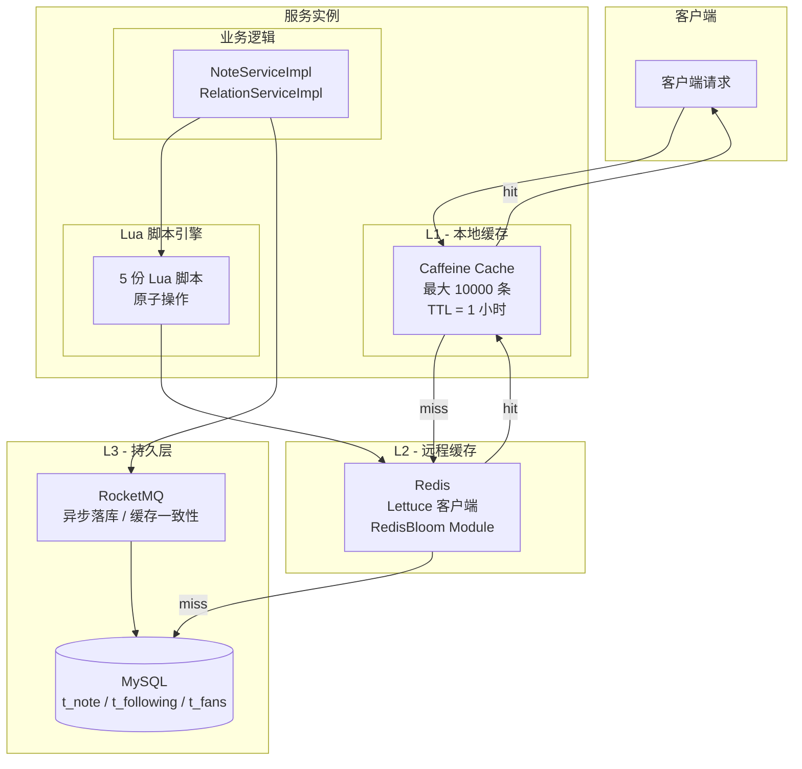
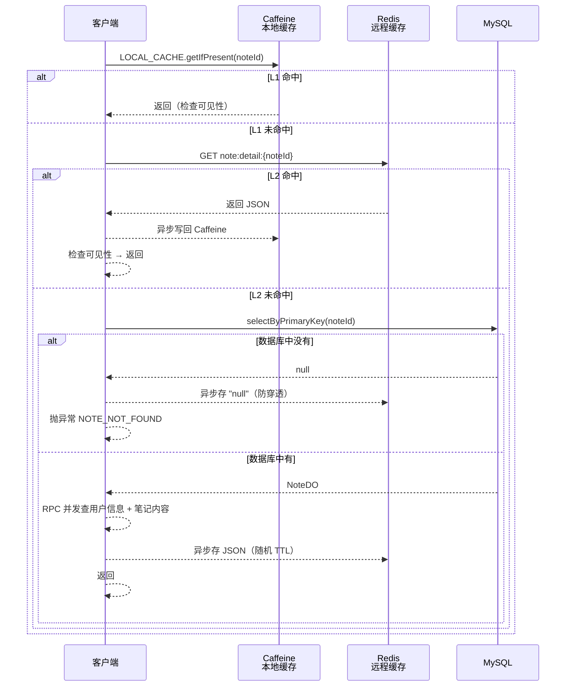
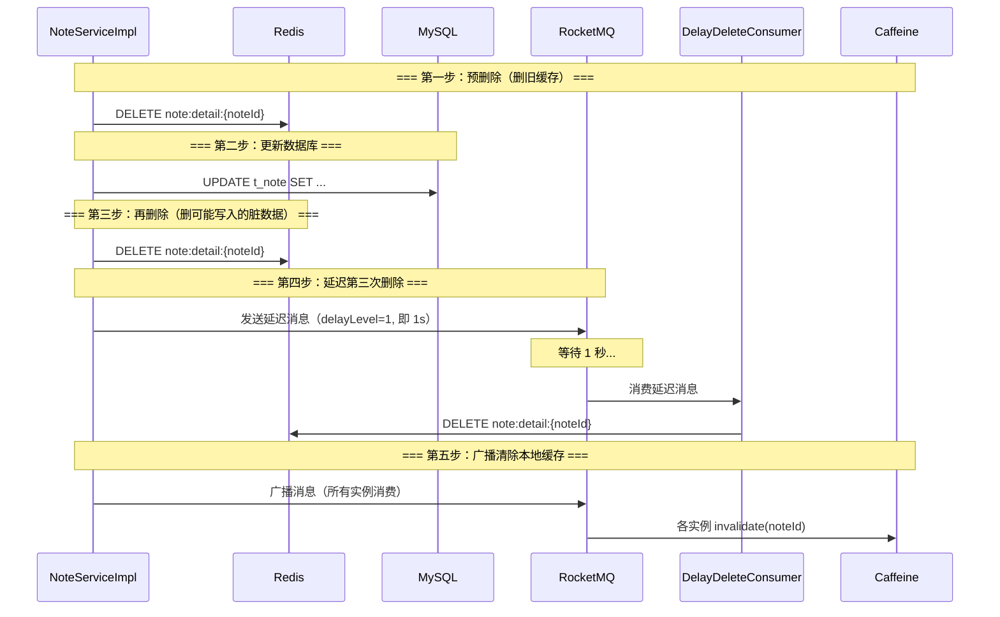
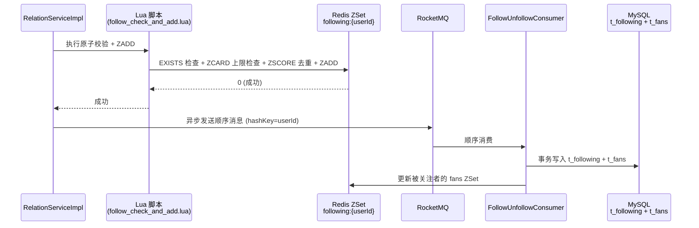
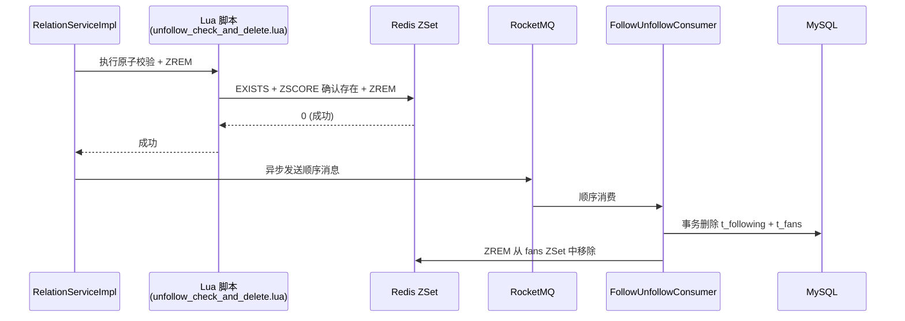
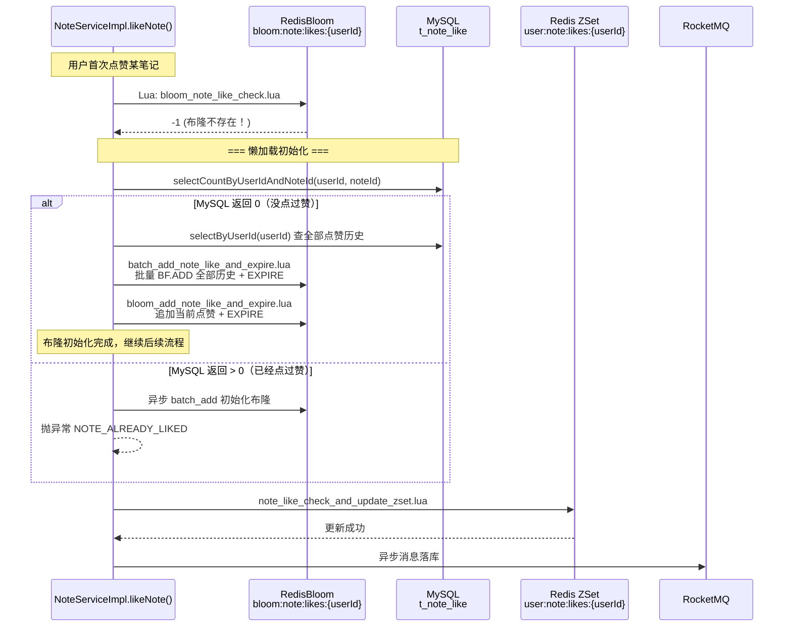

# Redis 缓存三大问题、一致性策略与布隆过滤器深度解析

> 本文以"小蓝书"（BlueNoteBook）项目的 `bluenote-note` 和 `bluenote-user-relation` 两个微服务模块为实际案例，深入讲解项目如何使用 Redis 解决**缓存穿透、缓存击穿、缓存雪崩**三大经典问题，以及如何通过**延迟双删、Redis-first + MQ**等策略保持 Redis 与 MySQL 之间的数据一致性。同时详细剖析 note 模块中的 **RedisBloom 布隆过滤器**——它是如何在笔记点赞场景中发挥"守门员"作用的。

---

## 一、开篇：为什么缓存不是"存进去读出来"这么简单

### 1.1 三个"隐形杀手"

如果你刚接触缓存，可能会觉得它的使用很简单——数据来了就存，请求来了就取，没有就去数据库查。但实际上，在**高并发**的生产环境中，缓存会遭遇三个经典问题：

| 问题 | 一句话描述 | 生活化比喻 |
|------|-----------|-----------|
| **缓存穿透** | 请求的数据**缓存和数据库都没有**，每次请求都穿透缓存直接打到数据库 | 黄牛反复查询一个**不存在的演出座位号**，售票窗口被无效查询淹没 |
| **缓存击穿** | 某个**热点数据**的缓存突然过期，大量并发请求同时砸向数据库 | 演唱会门票开售瞬间，缓存失效那一刻，**所有人同时涌向售票窗口** |
| **缓存雪崩** | **大量缓存同时过期**，数据库瞬间承受巨量请求 | 购物节的秒杀商品都在**同一秒**结束缓存，数据库被瞬间压垮 |

### 1.2 BlueNoteBook 的缓存架构总览

在深入具体策略之前，先看一下项目的整体缓存架构：



这是一个典型的**两级缓存 + 异步写回**架构：

- **L1（Caffeine）**：JVM 堆内本地缓存，响应速度微秒级，容量上限 10000 条，1 小时过期
- **L2（Redis）**：分布式远程缓存，服务集群共享，响应速度毫秒级
- **L3（MySQL）**：持久化存储，数据源

> **设计哲学**：项目没有使用 Spring Cache 的 `@Cacheable` / `@CacheEvict` 注解，也没有引入 Redisson 等重型框架。所有缓存逻辑全部**手动编码**在 Service 层中。这种"手写"方式虽然增加了代码量，但带来了**完全可控的缓存行为**和**透明的问题排查路径**。

---

## 二、项目整体 Redis 基础设施

在深入具体模块之前，需要先了解项目共用的 Redis 基础设施。

### 2.1 客户端与连接配置

项目统一使用 **Lettuce** 作为 Redis 客户端（Spring Boot Data Redis 的默认实现），配合 **commons-pool2** 连接池：

```yaml
# 各模块的 application-dev.yml（配置完全相同）
spring:
  data:
    redis:
      database: 0
      host: 127.0.0.1
      port: 6379
      timeout: 5s
      connect-timeout: 5s
      lettuce:
        pool:
          max-active: 200   # 最大活跃连接数
          max-wait: -1ms    # 等待可用连接不超时
          min-idle: 0       # 最小空闲连接
          max-idle: 10      # 最大空闲连接
```

### 2.2 序列化方案

所有模块共用一套序列化配置（每个模块各自定义了一份完全相同的 `RedisTemplateConfig`）：

- **Key 序列化**：`StringRedisSerializer`（纯字符串，可读性好）
- **Value 序列化**：`Jackson2JsonRedisSerializer<Object>`（JSON 格式，跨语言兼容）

> **小知识**：note 模块的 `NoteServiceImpl` 声明的是 `RedisTemplate<String, String>`，其他模块用的是 `RedisTemplate<String, Object>`。这个差异是因为 note 模块的缓存值以 JSON 字符串形式手动序列化后再存入 Redis，而非依赖底层序列化器。

### 2.3 两个模块的缓存 Key 全景

| 模块 | Key 模式 | 数据类型 | 用途 | 容量上限 |
|------|---------|---------|------|---------|
| **note** | `note:detail:{noteId}` | String (JSON) | 缓存笔记详情 | 无 |
| **note** | `bloom:note:likes:{userId}` | RedisBloom Filter | 判断用户是否点赞过 | N/A |
| **note** | `user:note:likes:{userId}` | ZSet | 用户点赞的笔记列表 | 100 |
| **relation** | `following:{userId}` | ZSet | 用户关注的用户列表 | 1000 |
| **relation** | `fans:{userId}` | ZSet | 用户的粉丝列表 | 5000 |

> **Key 命名规范**：`entity:subcategory:{id}` —— 冒号分隔，语义清晰。不使用环境前缀（如 `dev:`），因为不同环境使用不同的 Redis database 或实例隔离。

---

## 三、Note 模块：笔记详情的缓存策略

`NoteServiceImpl.java`（864 行）是 note 模块中所有缓存逻辑的集中地。我们按照**读路径 → 穿透 → 击穿 → 雪崩 → 一致性**的顺序逐一分析。

### 3.1 多级缓存读路径

笔记详情查询 `findNoteDetail()` 的完整读流程：



对应到 `NoteServiceImpl.java` 的关键代码（第 209-319 行）：

```java
// 第一层：Caffeine 本地缓存
String findNoteDetailRspVOStrLocalCache = LOCAL_CACHE.getIfPresent(noteId);
if (StringUtils.isNotBlank(findNoteDetailRspVOStrLocalCache)) {
    // 命中 → 直接返回
    return Response.success(findNoteDetailRspVO);
}

// 第二层：Redis 远程缓存
String noteDetailKey = RedisKeyConstants.buildNoteDetailKey(noteId);
String noteDetailJson = redisTemplate.opsForValue().get(noteDetailKey);
if (StringUtils.isNotBlank(noteDetailJson)) {
    // 命中 → 返回 + 异步写回 Caffeine
    threadPoolTaskExecutor.submit(() ->
        LOCAL_CACHE.put(noteId, JsonUtils.toJsonString(findNoteDetailRspVO)));
    return Response.success(findNoteDetailRspVO);
}

// 第三层：MySQL 数据库
NoteDO noteDO = noteDOMapper.selectByPrimaryKey(noteId);
```

**设计亮点**：

1. **异步写回**：所有写缓存操作（写 Caffeine / 写 Redis）都通过 `threadPoolTaskExecutor.submit()` 异步执行，不阻塞请求响应
2. **并行 RPC**：从 MySQL 查出笔记后，通过 `CompletableFuture.allOf()` 并发调用用户服务和 KV 存储服务，减少串行等待

### 3.2 缓存穿透：空值缓存

当恶意用户反复请求一个不存在的 noteId（如 `noteId = 99999999`），每次请求都会穿透缓存、查询数据库并返回 null。如果不加防护，数据库会被无效查询打垮。

**解决方案：Null Object Pattern（空值缓存）**

代码位于 `NoteServiceImpl.java` 第 241-248 行：

```java
if (Objects.isNull(noteDO)) {
    threadPoolTaskExecutor.execute(() -> {
        // 防止缓存穿透，将空数据存入 Redis 缓存
        // 保底1分钟 + 随机秒数
        long expireSeconds = 60 + RandomUtil.randomInt(60);
        redisTemplate.opsForValue().set(
            noteDetailKey, "null", expireSeconds, TimeUnit.SECONDS);
    });
    throw new BizException(ResponseCodeEnum.NOTE_NOT_FOUND);
}
```

**策略要点**：

| 参数 | 值 | 理由 |
|------|---|------|
| 缓存值 | `"null"` 字符串 | 标记这是一个"空"缓存，下次命中时直接返回异常 |
| 基础 TTL | 60 秒 | 短 TTL，防止新创建的笔记被误判为不存在 |
| 随机偏移 | 0-60 秒 | 防雪崩打散过期时间 |
| 有效 TTL | 60-120 秒 | 足够拦截恶意攻击，又不会让正常数据等太久 |

> **为什么不在这里用布隆过滤器？** 笔记 ID 是通过分布式 ID 生成器生成的全局唯一 ID，理论上**任何 ID 都是"可能存在"的**——你无法在创建之前预测哪些 ID 会被创建。布隆过滤器适用于"集合成员判断"（如"用户 X 是否点赞过笔记 Y"），而不适用于"不存在的 ID 判断"。相比之下，空值缓存在这个场景更直接有效。

### 3.3 缓存击穿：多级兜底而非互斥锁

缓存击穿的"标准解法"是加分布式互斥锁——只让一个线程去查数据库重建缓存，其他线程等待。但 note 模块**没有使用任何分布式锁**。

**为什么？设计取舍分析：**

1. **L1 Caffeine 本地缓存天然缓冲**：即使 Redis 缓存过期，Caffeine 可能还持有该数据（1 小时 TTL）。只要有一个请求命中 Caffeine 并返回，就不会形成"所有请求同时穿透"的局面
2. **主键查询本身就是最快的**：`selectByPrimaryKey(noteId)` 是主键索引查找，MySQL 的 B+Tree 能在毫秒级完成，不需要排队等待
3. **异步重建不阻塞响应**：缓存写入是异步的，请求本身不会被"等缓存重建"阻塞
4. **加锁的代价 > 偶尔重复查 DB 的代价**：引入 Redisson 分布式锁意味着额外的网络开销、锁管理复杂度、死锁风险。对于主键查询这种快速操作，性价比不高

```
没有锁的击穿处理：
  请求A: Redis miss → MySQL 主键查(1ms) → 返回 → 异步写 Redis
  请求B: Redis miss → MySQL 主键查(1ms) → 返回 → 异步写 Redis
  请求C: Redis miss → MySQL 主键查(1ms) → 返回 → 异步写 Redis
  → 数据库多承受 3 次查询，但每次仅 1ms，影响可控

如果用锁：
  请求A: Redis miss → 抢锁 → MySQL(1ms) → 写 Redis → 释放锁
  请求B: Redis miss → 等锁(50ms) → Redis hit → 返回
  请求C: Redis miss → 等锁(50ms) → Redis hit → 返回
  → 虽然只查了 1 次 DB，但 B 和 C 多等了 50ms + 增加了锁管理复杂度
```

### 3.4 缓存雪崩：随机化 TTL

如果所有笔记的 Redis 缓存都在同一时刻过期，那一瞬间的所有读请求都会打到 MySQL。note 模块通过**给每个缓存 key 添加随机过期偏移**来避免这个问题：

```java
// 笔记详情缓存：保底1天 + 随机0~3600秒
long expireSeconds = 60*60*24 + RandomUtil.randomInt(60*60);

// 空值缓存：保底60秒 + 随机0~60秒
long expireSeconds = 60 + RandomUtil.randomInt(60);
```

**实际 TTL 分布效果**：

```text
笔记 A: 86400 + 1823 = 88223 秒（约 24.5 小时）
笔记 B: 86400 + 3412 = 89812 秒（约 24.9 小时）
笔记 C: 86400 + 87   = 86487 秒（约 24.0 小时）
笔记 D: 86400 + 2500 = 88900 秒（约 24.7 小时）
...
→ 10000 篇笔记的过期时间分布在 24h ~ 25h 的区间内，不会同时过期
```

**完整 TTL 策略表**：

| 缓存内容 | 基础 TTL | 随机偏移 | 有效范围 |
|---------|---------|---------|---------|
| 笔记详情（有效数据） | 86400s (1天) | 0-3600s (0-1小时) | 1天 ~ 1天+1小时 |
| 笔记详情（空值） | 60s | 0-60s | 60s ~ 120s |
| Caffeine 本地缓存 | 3600s (1小时) | 无（固定） | 恰好 1 小时 |

> Caffeine 不支持随机 TTL（它是固定 `expireAfterWrite`），但由于 Redis 层已经做了随机化，且 Caffeine 数据来自 Redis 的回写，所以整体过期时间已被打散。

### 3.5 数据一致性：延迟双删（Delay Double Delete）

这是 note 模块最核心的一致性策略。当用户更新笔记时，如何保证 Redis 和 MySQL 中的数据一致？

**标准 Cache-Aside 的困境**：

```
操作顺序A: 先删缓存 → 再更新数据库
  问题: 删缓存后、更新DB前，有读请求进来，把旧数据写入了缓存

操作顺序B: 先更新数据库 → 再删缓存
  问题: 更新DB成功、删缓存前，有读请求读到了旧缓存
```

**延迟双删方案**（`updateNote()` 方法，第 383-469 行）：



对应代码：

```java
// 第一次删除：在更新 MySQL 之前
String noteDetailRedisKey = RedisKeyConstants.buildNoteDetailKey(noteId);
redisTemplate.delete(noteDetailRedisKey);

// ... 更新 MySQL ...
noteDOMapper.updateByPrimaryKeySelective(noteDO);

// 第二次删除：更新 MySQL 之后立即删除
String noteDetailKey = RedisKeyConstants.buildNoteDetailKey(noteId);
redisTemplate.delete(noteDetailKey);

// 第三次删除：通过 MQ 延迟 1 秒后再次删除
Message<String> message = MessageBuilder.withPayload(String.valueOf(noteId)).build();
rocketMQTemplate.asyncSend(
    MQConstants.TOPIC_DELAY_DELETE_NOTE_REDIS_CACHE, message,
    new SendCallback() { ... },
    3000,  // 超时 3 秒
    1      // 延迟级别 1 = 1 秒
);

// 广播模式删除所有实例的 Caffeine 本地缓存
rocketMQTemplate.syncSend(MQConstants.TOPIC_DELETE_NOTE_LOCAL_CACHE, noteId);
```

**为什么延迟 1 秒？**

这个 1 秒是为了覆盖"第二次删除"和"可能发生的读请求写回脏数据"之间的窗口。假设：
- t0: 第二次删除执行完毕
- t0+0.1s: 某个读请求发现 Redis 无数据，去 MySQL 查询
- t0+0.2s: MySQL 主从同步可能还没完成（如果有主从架构），读到了旧数据
- t0+0.3s: 读请求将旧数据写入 Redis

延迟 1 秒后的第三次删除可以清除这种"刚写入的脏数据"。当然，这对于缓存一致性是**最终一致性**保证，而非强一致性。

> **deleteNote / visibleOnlyMe / topNote 的一致性**：这些操作都调用统一的 `deleteNoteCache(noteId)` 方法（第 771-777 行），执行 Redis key 删除 + 广播 MQ 消息清除所有实例的 Caffeine 本地缓存。

---

## 四、Relation 模块：关注/粉丝列表的缓存策略

Relation 模块（`bluenote-user-relation`）使用 Redis 缓存用户的**关注列表**和**粉丝列表**。与 note 模块不同，这里使用 **Sorted Set（ZSet）** 作为数据容器。

### 4.1 为什么选择 ZSet？

关系数据天然需要：
- **按时间排序**：最近关注的人排在前面
- **分页查询**：每页 10 条，支持翻页
- **快速去重检查**：判断是否已关注某用户
- **数量限制**：关注上限 1000 人，粉丝取前 5000

ZSet 完美满足这些需求：

| 需求 | ZSet 实现 | Redis 命令 |
|------|----------|-----------|
| 按时间排序 | `score = create_time` 时间戳 | `ZADD key timestamp userId` |
| 分页查询 | `offset + limit` 按分数范围 | `ZREVRANGEBYSCORE key -inf +inf LIMIT offset count` |
| 去重检查 | ZSet member 天然唯一 | `ZSCORE key userId` |
| 数量上限 | `ZCARD` + 条件判断 | `ZCARD key` |

```text
following:10001 (ZSet)
┌─────────────────────────────────────────────┐
│  Score (关注时间戳)    Member (被关注用户ID)    │
├─────────────────────────────────────────────┤
│  1729000000            10086                │  ← 最早关注
│  1729100000            10099                │
│  1729200000            10102                │
│  1729400000            10200                │  ← 最近关注
└─────────────────────────────────────────────┘
```

### 4.2 读路径：zCard 判断 + 分页查询 + 异步回填

以 `findFollowingList()` 为例（第 250-321 行）：

```java
// 1. 先看 Redis ZSet 有没有数据
Long total = redisTemplate.opsForZSet().zCard(userFollowingKey);

if (total > 0) {
    // 2a. Redis 有数据 → 直接 ZREVRANGEBYSCORE 分页查询
    Set<Object> followingUserIdsSet = redisTemplate.opsForZSet()
        .reverseRangeByScore(userFollowingKey, Double.NEGATIVE_INFINITY,
                             Double.POSITIVE_INFINITY, offset, limit);
    // → RPC 查用户信息 → 返回
} else {
    // 2b. Redis 无数据 → 降级到 MySQL 分页查询
    List<FollowingDO> followingDOs = followingDOMapper
        .selectPageListByUserId(userId, offset, limit);
    // → RPC 查用户信息 → 返回
    // → 异步将全量关注关系同步到 Redis
    threadPoolTaskExecutor.submit(() -> syncFollowingList2Redis(userId));
}
```

**设计要点**：

- `zCard > 0` 作为"缓存是否有效"的判断依据——如果 Redis 中有关注数据，就信任 Redis
- 如果 Redis 命中，**只返回当前页需要的 10 条**用户 ID，不把整个 ZSet 加载到内存
- 如果 Redis 未命中，降级到 MySQL 查询后**异步全量回填**到 Redis，下次访问就能命中

### 4.3 写路径：Redis-first + MQ 异步落库

这是 relation 模块与 note 模块最大的不同——**写操作先更新 Redis，再通过 MQ 异步持久化到 MySQL**。

**follow（关注）流程**：



**unfollow（取关）流程**：



**为什么是 Redis-first 而非 DB-first？**

1. **即时反馈**：用户点击"关注"后立刻就能在列表中看到变化（Redis 已更新）
2. **Lua 原子性**：Redis 端的校验（上限、去重）是原子的，不会出现并发竞争
3. **MQ 异步削峰**：数据库写入通过 MQ 解耦，写入峰值不会阻塞用户请求
4. **顺序消息**：`asyncSendOrderly` + `hashKey = userId` 保证同一用户的操作严格有序

> **一致性窗口**：fan 的 ZSet 在消费者中才更新（非同步），所以被关注者的粉丝列表会有短暂的"最终一致性"延迟。但用户自己的关注列表是即时准确的。

### 4.4 缓存穿透：ZSET_NOT_EXIST 的兜底逻辑

Relation 模块没有使用空值缓存。它的防穿透策略是：

1. **首次访问时，ZSet key 不存在** → Lua 脚本返回 `-1`（`ZSET_NOT_EXIST`）
2. **Java 代码捕获 `-1`** → 查询 MySQL 获取用户的关注历史
3. **如果 MySQL 有数据** → 批量回填到 Redis ZSet + 随机 TTL
4. **如果 MySQL 也无数据**（用户从未关注任何人）→ 首次 follow 时直接创建 ZSet

```java
// 当 ZSet 不存在时（RelationServiceImpl.follow() 第 113-148 行）
if (Objects.equals(result, LuaResultEnum.ZSET_NOT_EXIST.getCode())) {
    List<FollowingDO> followingDOS = followingDOMapper.selectByUserId(userId);

    if (CollUtil.isEmpty(followingDOS)) {
        // 从未关注任何人 → 直接创建 ZSet，插入第一条数据
        redisTemplate.execute(script2, ..., followUserId, timestamp, expireSeconds);
    } else {
        // 有历史数据 → 全量批量同步到 Redis
        redisTemplate.execute(script3, ..., luaArgs);
        // 再次执行关注操作
        redisTemplate.execute(script, ..., followUserId, timestamp);
    }
}
```

这个策略避免了缓存穿透——因为不存在空 ZSet（要么 key 不存在，要么就包含真实数据）。

### 4.5 缓存击穿与雪崩

**击穿**：与 note 模块一样，relation 模块**不使用分布式锁**。原因类似——关注列表的 MySQL 查询是索引查询（`idx_user_id`），速度快；且异步回填机制使得下次访问就会命中。

**雪崩**：所有 ZSet 的 TTL 设置都使用随机过期：

```java
// 出现在 follow(), unfollow(), syncFollowingList2Redis(), syncFansList2Redis()
long expireSeconds = 60*60*24 + RandomUtil.randomInt(60*60*24);
// 范围：1天 ~ 2天
```

还有一个未实现的 TODO（第 127 行注释）：

```java
// TODO: 可以根据用户类型，设置不同的过期时间，若当前用户为大V,
// 则可以过期时间设置的长些或者不设置过期时间；如不是，则设置的短些
// 如何判断呢？可以从计数服务获取用户的粉丝数，目前计数服务还没创建，则暂时采用统一的过期策略
```

这个优化的逻辑是：大 V 的关注/粉丝列表是热点数据，过期会导致大量 DB 查询；而普通用户的列表不那么热。未来可以差异化 TTL。

---

## 五、Note 模块：点赞功能的 RedisBloom 布隆过滤器

这是 note 模块最精巧的设计之一。笔记点赞功能使用 **布隆过滤器 + ZSet + MySQL** 三层结构来判断"用户是否已经点赞过"。

### 5.1 布隆过滤器通俗原理

布隆过滤器（Bloom Filter）是一种**空间效率极高**的概率性数据结构，它能告诉你：

- ✅ **"这个元素一定不存在"**（100% 准确）
- ⚠️ **"这个元素可能存在"**（有小概率误判）

它的结构非常简洁：

```text
        元素 "apple"                      元素 "banana"
            │                                │
            ▼                                ▼
      ┌── Hash1("apple") = 2          Hash1("banana") = 5
      │   Hash2("apple") = 7          Hash2("banana") = 3
      │   Hash3("apple") = 11         Hash3("banana") = 7
      │                                     │
      ▼                                     ▼
   ┌──┬──┬──┬──┬──┬──┬──┬──┬──┬──┬──┬──┬──┬──┐
   │0 │0 │1 │0 │0 │1 │0 │1 │0 │0 │0 │1 │0 │..│  位数组 (bit array)
   └──┴──┴──┴──┴──┴──┴──┴──┴──┴──┴──┴──┴──┴──┘
    0  1  2  3  4  5  6  7  8  9 10 11 12

查询 "cherry":
  Hash1=2(1) Hash2=7(1) Hash3=11(1) → 三个位置都是 1 → 可能存在（但实际上没存过，误判！）

查询 "orange":
  Hash1=1(0) Hash2=4(0) Hash3=9(0) → 位置 1 是 0 → 一定不存在 ✓
```

**核心特性**：
- 空间效率：存储 N 个元素只需要 M 个 bit，远小于实际元素大小
- 不可删除：因为多个元素共享 bit 位，置 0 会影响其他元素的判断
- 误判率可控：通过调整 bit 数组大小和哈希函数数量，可以将误判率控制在可接受范围

### 5.2 点赞场景为什么需要布隆过滤器？

问题场景：用户每次点赞前，系统需要判断"这个用户是否已经点赞过这篇笔记"。

**没有布隆过滤器时的查询链路**：

```text
用户点"赞" → Redis ZSet.score() 查是否已点赞
  → ZSet 不存在（过期了）→ MySQL 查是否已点赞
    → 结果：没有点过赞 → 返回，允许点赞
```

大多数情况下用户**没有点赞过**这篇笔记（99%+ 的请求），但每次都要经历 Redis 查询甚至 MySQL 降级查询，这些查询大部分是"白查"。

**有了布隆过滤器后的查询链路**：

```text
用户点"赞" → 布隆 BF.EXISTS 快速判断
  → "一定不存在"（99% 的请求命中）→ 直接允许点赞，跳过 ZSet 和 MySQL
  → "可能存在"（1% 可能已经点过赞）→ 再查 ZSet 精确验证
    → ZSet 也不存在 → 最终查 MySQL 确认
```

布隆过滤器在这里充当了**快速拦截器**的角色——拦住 99% 的"肯定没点过"的无效穿透，只让 1% 的"可能点过"进入下一步精确验证。

### 5.3 RedisBloom 的集成方式

项目中 RedisBloom 不是通过 Redisson 的 `RBloomFilter` 类调用的，而是通过**原生 Lua 脚本**直接调用 Redis 的 `BF.EXISTS` 和 `BF.ADD` 命令。

> **前提条件**：Redis 服务器需要安装 RedisBloom Module（`redisbloom.so`），否则 Lua 脚本会报错 `unknown command 'BF.EXISTS'`。

**三份布隆 Lua 脚本**：

#### ① bloom_note_like_check.lua —— 校验并标记

```lua
local key = KEYS[1]          -- bloom:note:likes:{userId}
local noteId = ARGV[1]       -- 笔记ID

-- 检查布隆过滤器是否存在
local exists = redis.call('EXISTS', key)
if exists == 0 then
    return -1                -- 布隆不存在，需初始化
end

-- 校验该篇笔记是否被点赞过
local isLiked = redis.call('BF.EXISTS', key, noteId)
if isLiked == 1 then
    return 1                 -- 可能存在（已点赞），需进一步确认
end

-- 未被点赞（一定不存在），添加点赞数据到布隆
redis.call('BF.ADD', key, noteId)
return 0                     -- 点赞成功
```

**返回值含义**：

| 返回值 | 含义 | Java 枚举 |
|--------|------|-----------|
| `-1` | 布隆过滤器 key 不存在，需要初始化 | `NOT_EXIST` |
| `1` | 布隆判断"可能存在"，需进一步查 ZSet/MySQL | `NOTE_LIKED` |
| `0` | 布隆判断"一定不存在"，直接允许点赞 | `NOTE_LIKE_SUCCESS` |

#### ② bloom_add_note_like_and_expire.lua —— 单条添加 + 过期

```lua
-- 用途：布隆 key 已存在但首次被加载完成后，追加本次点赞
-- 或 ZSet 不存在但布隆已存在时，添加新记录
-- 参数：KEYS[1]=bloom key, ARGV[1]=noteId, ARGV[2]=expireSeconds
-- （实现直接执行 BF.ADD + EXPIRE）
```

#### ③ bloom_batch_add_note_like_and_expire.lua —— 批量添加 + 过期

```lua
-- 用途：布隆过滤器首次初始化时，批量加载用户全部点赞历史
-- 参数：KEYS[1]=bloom key, ARGV[1..N-1]=noteId列表, ARGV[N]=expireSeconds
-- 循环调用 BF.ADD，最后 EXPIRE
```

### 5.4 布隆过滤器的懒加载初始化流程

布隆过滤器**不是在应用启动时创建的**，而是在用户首次点赞时懒加载。完整流程：



对应 Java 代码（第 595-616 行）：

```java
case NOT_EXIST -> {
    // 布隆不存在 → 从数据库中校验笔记是否被点赞
    int count = noteLikeDOMapper.selectCountByUserIdAndNoteId(userId, noteId);
    long expireSeconds = 60*60*24 + RandomUtil.randomInt(60*60*24);

    if (count > 0) {
        // 已经点过赞了，异步初始化布隆，然后抛异常
        threadPoolTaskExecutor.submit(() ->
            batchAddNoteLike2BloomAndExpire(userId, expireSeconds, bloomUserNoteLikeListKey));
        throw new BizException(ResponseCodeEnum.NOTE_ALREADY_LIKED);
    }

    // 没点过赞 → 全量同步历史点赞到布隆 + 插入当前点赞
    batchAddNoteLike2BloomAndExpire(userId, expireSeconds, bloomUserNoteLikeListKey);
    // ... 继续执行添加操作
}
```

### 5.5 布隆过滤器的误判处理：三重校验

布隆过滤器是概率性的——它说"可能存在"的时候，有极小概率其实是误判。项目通过**三重校验**来消除误判的影响：

```text
第一重：布隆过滤器 (RedisBloom)
  ├─ BF.EXISTS = 0 → "一定不存在" ✓ → 直接允许点赞（快速路径）
  └─ BF.EXISTS = 1 → "可能存在" → 进入第二重校验

第二重：ZSet (Redis)
  ├─ ZSCORE 存在 → 确实点过赞 ✓ → 抛异常
  └─ ZSCORE 不存在 → 进入第三重校验

第三重：MySQL (数据库)
  ├─ COUNT > 0 → 确实点过赞（布隆误判 + ZSet 过期）→ 异步重建 ZSet + 抛异常
  └─ COUNT = 0 → 布隆误判了 → 允许点赞
```

对应代码（第 618-632 行）：

```java
case NOTE_LIKED -> {
    // 布隆说"可能存在"，先查 ZSet 精确验证
    Double score = redisTemplate.opsForZSet().score(userNoteLikeZSetKey, userId);

    if (Objects.nonNull(score)) {
        // ZSet 中有 → 确实已点赞
        throw new BizException(ResponseCodeEnum.NOTE_ALREADY_LIKED);
    }

    // ZSet 中没有 → 查 MySQL 最终确认
    int count = noteLikeDOMapper.selectCountByUserIdAndNoteId(userId, noteId);
    if (count > 0) {
        // 数据库有记录，但 ZSet 过期了 → 异步重建 ZSet
        asynInitUserNoteLikesZSet(userId, userNoteLikeZSetKey);
        throw new BizException(ResponseCodeEnum.NOTE_ALREADY_LIKED);
    }
    // count = 0 → 纯属布隆误判，允许点赞
}
```

### 5.6 布隆 + ZSet + MySQL 三层架构总结

```text
┌─────────────────────────────────────────────────────────────┐
│                    笔记点赞的三层验证架构                      │
├───────────────┬─────────────────┬───────────────────────────┤
│   层级        │  数据结构        │  职责                      │
├───────────────┼─────────────────┼───────────────────────────┤
│ L1 - 快速过滤 │ RedisBloom      │ 99% 的"未点赞"路由在此拦截 │
│              │ (bloom:...:     │ 空间效率极高，每个用户    │
│              │  {userId})      │ 的布隆仅占用少量内存       │
├───────────────┼─────────────────┼───────────────────────────┤
│ L2 - 精确缓存 │ Redis ZSet      │ 存储最近 100 条点赞关系    │
│              │ (user:note:     │ 超出 100 条时 ZPOPMIN 淘汰 │
│              │  likes:{userId})│ 按时间排序，支持分页查看     │
├───────────────┼─────────────────┼───────────────────────────┤
│ L3 - 持久存储 │ MySQL t_note_like│ 全量历史点赞记录          │
│              │                 │ 异步落库 + 唯一索引去重     │
└───────────────┴─────────────────┴───────────────────────────┘
```

**布隆过滤器 TTL 的关键设计**：

布隆过滤器不能被"删除"元素（取消点赞后无法从布隆中移除）。项目的解决方案是：**设置 TTL 让布隆过期，然后从 MySQL 重建**。

```java
// 布隆 TTL：1天 + 随机0~1天（总范围 1~2 天）
long expireSeconds = 60*60*24 + RandomUtil.randomInt(60*60*24);
```

过期后下一篇文章点赞时触发懒重建，从 MySQL 全量加载点赞历史重新 BF.ADD。这样：
- **新增的点赞**会立即添加到布隆
- **取消的点赞**在布隆过期前可能产生误判（布隆说"可能存在"，实际已取消），但会被 ZSet 和 MySQL 两重校验纠正
- **布隆过期后**重建时只包含当前有效的点赞关系，自动清理了已取消的记录

---

## 六、两个模块的一致性策略对比

| 维度 | Note 模块（笔记详情） | Relation 模块（关注/粉丝） |
|------|---------------------|--------------------------|
| **一致性模式** | Cache-Aside + 延迟双删 | Redis-first + Write-Behind (MQ) |
| **写入顺序** | MySQL 优先，Redis 跟随 | Redis 优先，MySQL 异步跟随 |
| **缓存失效策略** | 主动删除 + 延迟 MQ 再删除 | 实时 Lua 更新（不会有过期脏数据） |
| **本地缓存清除** | 广播 MQ → 所有实例 invalidate | 不使用本地缓存 |
| **一致性窗口** | ~1 秒（延迟删窗口） | 关注列表即时；粉丝列表 ~几十毫秒（MQ 消费延迟） |
| **失败处理** | MQ 消费失败 → 缓存存旧数据 → 等下次 TTL 过期 | MQ 消费失败 → MySQL 数据丢失风险（需重试队列保障） |
| **适用场景特征** | 读写比极高（笔记读 >> 写） | 读写比中等（关注操作频繁） |
| **性能特点** | 读优化，写惩罚去缓存 | 写优化（即时反馈），读优化（ZSet O(logN)） |

**两种策略的选择依据**：

```
              数据更新频率
                   │
      低（笔记更新）│     高（关注/取关）
                   │
  ┌────────────────┼────────────────┐
  │                │                │
  ▼                │                ▼
Cache-Aside        │           Redis-first
+ 延迟双删         │           + MQ 异步写
                   │
优点：DB 是真理源   │          优点：写入即时反馈
     读性能极好    │                原子操作保证
     不会丢数据    │                适合高频操作
                   │
缺点：写代价高     │          缺点：MQ 失败风险
     有短暂不一致  │                有最终一致性窗口
```

---

## 七、总结与最佳实践

### 7.1 缓存三大问题的解决对照

| 问题 | Note 模块方案 | Relation 模块方案 |
|------|-------------|-----------------|
| **穿透** | 空值缓存 `"null"` + 短 TTL（60-120s） | Lua 脚本兜底 + MySQL 回填（不存在空 ZSet） |
| **击穿** | 多级缓存（Caffeine）天然缓冲 + 异步重建 | Lua 原子操作 + 异步回填 + 接受少量并发 |
| **雪崩** | 随机 TTL 打散（1d + rand(0-1h)） | 随机 TTL 打散（1d + rand(0-1d)） |

### 7.2 一致性策略速查

| 场景 | 策略 | 一句话记忆 |
|------|------|-----------|
| 笔记更新 | 延迟双删 | 删 → 写 → 删 → 等 1s → 再删 |
| 笔记删除 | 直接删 + 广播 | 删 Redis → MQ 广播删 Caffeine |
| 关注 | Redis 先写 + MQ 异步落库 | Lua 原子入 ZSet → MQ → MySQL 事务 |
| 取关 | Redis 先删 + MQ 异步落库 | Lua 原子出 ZSet → MQ → MySQL 事务 |

### 7.3 布隆过滤器用法的核心要点

1. **适用场景**：大量"一定不存在"的查询（如点赞去重、URL 去重、垃圾邮件过滤）
2. **不适用场景**：需要精确判断 + 频繁删除的场景（除非接受 TTL 过期重建）
3. **消除误判**：布隆 → ZSet → MySQL 三重递进验证
4. **解决不可删除**：通过短 TTL（1-2 天）让布隆自动过期，从数据库重建
5. **初始化时机**：懒加载（首次使用时创建），而非应用启动时全量加载

### 7.4 设计启发

回顾整个项目的缓存设计，有几个值得学习的取舍：

1. **没有分布式锁不等于不安全**：两个模块都选择"接受偶尔重复的 DB 查询"而非"引入锁增加复杂度"。当 DB 查询足够快（主键/索引），这种取舍是明智的

2. **Lua 脚本代替 Java 分布式锁**：Redis 单线程执行 Lua 脚本天然提供原子性，无需额外引入 Redisson。注意，Lua 脚本仍需配合业务逻辑处理 key 不存在的情况（返回 -1 让 Java 初始化）

3. **异步化是性能优化的大杀器**：缓存写入全部异步（`threadPoolTaskExecutor.submit()`），数据库写入用 MQ 异步削峰。主请求路径只做最必要的事

4. **TTL 不打散 = 雪崩风险**：项目中**每一个**设置 EXPIRE 的地方都加了随机偏移。这不是过度设计——在生产环境中，不随机化的 TTL 就是定时炸弹

5. **缓存逻辑内嵌 vs 抽象为 CacheService**：项目选择将所有缓存逻辑直接写在 Service 实现类中。好处是逻辑直观、排查方便；代价是代码冗长、复用性差。对于中小型项目这是合理的取舍，但模块增多后建议抽象缓存层

---

> **延伸阅读**：
> - [Redis与Lua脚本——关注系统背后的原子化设计哲学](./Redis与Lua脚本——关注系统背后的原子化设计哲学.md) —— 深入讲解 relation 模块中 5 份 Lua 脚本的设计原理
> - [ThreadLocal 与 TransmittableThreadLocal 深度解析](./ThreadLocal%20与%20TransmittableThreadLocal%20深度解析.md) —— 线程上下文在线程池异步调用中的传递问题
