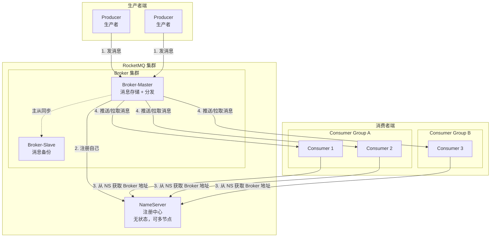
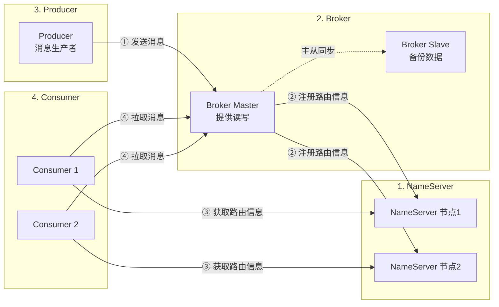
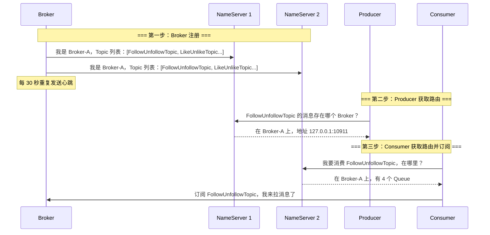
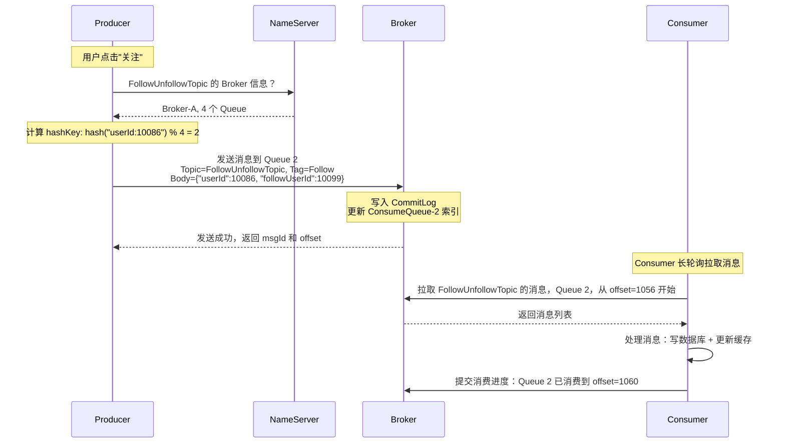
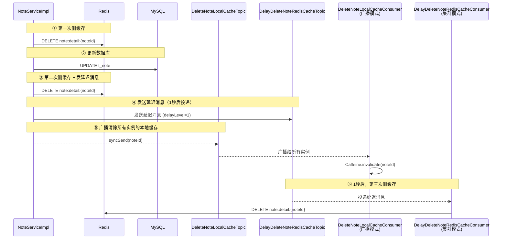
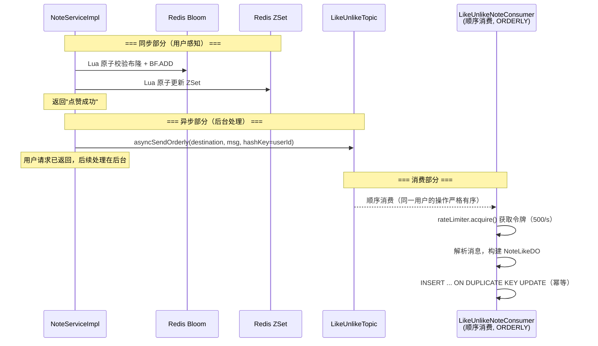
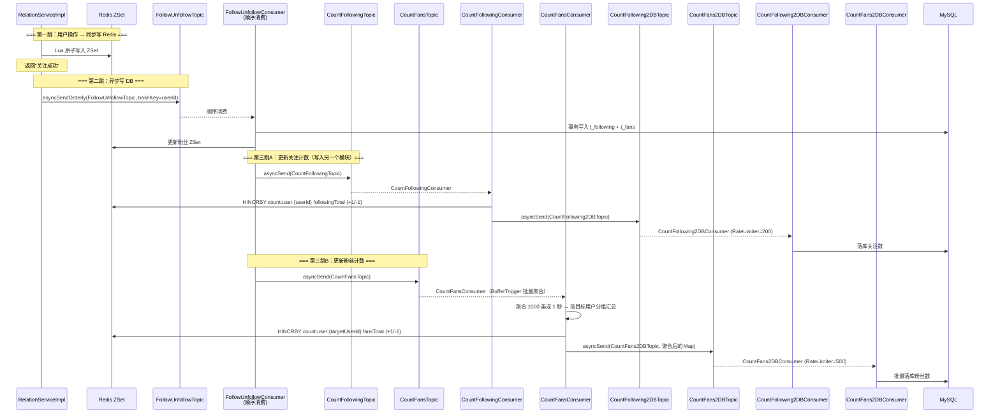

# RocketMQ 消息队列深度解析——从基础概念到项目实战

> 本文以初学者的视角，从"什么是消息队列"这个最基础的问题出发，逐步深入到 RocketMQ 的架构设计、核心组件、工作流程，最后结合"小蓝书"（BlueNoteBook）项目中 `bluenote-note` 和 `bluenote-user-relation` 模块的实际使用场景，让你不仅"知其然"，还能"知其所以然"。

---

## 一、基础篇：什么是消息队列？

### 1.1 从一个生活中的例子说起

想象你开了一家奶茶店。创业初期，只有你一个人：

```text
顾客点单 → 你收钱 → 你做奶茶 → 顾客取走
```

这个模式在顾客少的时候完全没问题。但生意好了以后：

```text
顾客A点单 → 你收钱 → 你做奶茶（3分钟）→ 顾客A取走
顾客B等着 → 顾客C等着 → 顾客D也等着……
```

后面的顾客只能干等——因为你被"做奶茶"这个慢操作拖住了。

于是你想了个办法：**加一个取餐叫号屏**。

```text
顾客A点单 → 你收钱 → 你在小票上写"珍珠奶茶"→ 把小票贴到叫号屏上
顾客B点单 → 你收钱 → 你在小票上写"椰果奶茶"→ 把小票贴到叫号屏上
                                     ↓
                              （你继续收钱，不用等奶茶做好）
                                     ↓
                        后厨师傅看着叫号屏，一张一张做
                                     ↓
                        做好了叫号："A-001 请取餐！"
```

这就是**消息队列（Message Queue，简称 MQ）**的核心思想：

| 奶茶店的比喻 | 对应到软件系统 |
|-------------|--------------|
| 你（收银） | **生产者（Producer）**：产生任务的一方 |
| 小票 | **消息（Message）**：描述"要做什么"的数据 |
| 叫号屏 | **消息队列（Queue / Topic）**：暂存消息的地方 |
| 后厨师傅 | **消费者（Consumer）**：处理任务的一方 |
| 你收完钱就能接待下一位 | **异步解耦**：生产者不用等消费者处理完 |

### 1.2 消息队列解决什么核心问题？

用一句话概括：**消息队列让"生产消息"和"消费消息"这两件事可以异步进行，彼此不阻塞。**

它解决了三个核心问题：

#### 问题一：异步（Async）—— 让慢操作不要拖累快操作

```text
没有 MQ（同步）：
  用户点"关注" → 写数据库（10ms）→ 更新计数（20ms）→ 发通知（50ms）
  → 用户总共等了 80ms

有了 MQ（异步）：
  用户点"关注" → 写数据库（10ms）→ 扔一条消息到 MQ → 立刻返回
  → 用户只等了 10ms
  → MQ 在后台慢慢处理计数更新和发通知
```

#### 问题二：解耦（Decouple）—— 让系统之间不用直接"认识"对方

```text
没有 MQ（直接调用）：
  NoteService → 调用 UserService.updateCount()
  NoteService → 调用 NotificationService.send()
  NoteService → 调用 LogService.record()
  → NoteService 需要知道所有下游服务的存在

有了 MQ（消息解耦）：
  NoteService → 发送消息到 MQ Topic
  UserService ← 订阅 MQ Topic
  NotificationService ← 订阅 MQ Topic  
  LogService ← 订阅 MQ Topic
  → NoteService 只需要知道 Topic，不需要知道谁在消费
```

#### 问题三：削峰（Traffic Shaping）—— 让系统不会被突然的流量冲垮

```text
没有 MQ：
  秒杀时刻，10000 个请求同时打到数据库
  → 数据库连接池耗尽 → 系统崩溃

有了 MQ：
  10000 个请求 → 消息进入 MQ 堆积
  → 消费者以自己处理能力的速度（比如每秒 500 条）慢慢消化
  → 数据库始终在承受能力范围内
```

### 1.3 主流消息队列对比

在进入 RocketMQ 之前，先了解它在消息队列"家族"中的位置：

| 特性 | RocketMQ | Kafka | RabbitMQ | ActiveMQ |
|------|----------|-------|----------|----------|
| **出身** | 阿里巴巴 | LinkedIn | Rabbit Technologies | Apache |
| **语言** | Java | Java/Scala | Erlang | Java |
| **吞吐量** | 十万级 | **百万级**（最高） | 万级 | 万级 |
| **延时** | 毫秒级 | 毫秒级 | **微秒级**（最低） | 毫秒级 |
| **事务消息** | ✅ **原生支持** | ❌ | ❌ | ✅ |
| **延迟消息** | ✅ **18个级别** | ❌（需插件） | ✅（需插件） | ✅ |
| **顺序消息** | ✅ **原生支持** | 分区内有序 | ❌ | ✅ |
| **消息过滤** | Tag + SQL92 | ❌ | Routing Key | Selector |
| **阿里云兼容** | ✅ 完美 | ❌ | ❌ | ❌ |

> **RocketMQ 的定位**：在 Kafka 的超高吞吐和 RabbitMQ 的灵活路由之间找到了一个平衡点。特别适合**电商、金融、社交**这类需要事务消息、顺序消息、延迟消息的互联网业务场景。BlueNoteBook 选择 RocketMQ 的重要原因之一就是它对**顺序消息**和**延迟消息**的原生支持。

---

## 二、概念篇：RocketMQ 的核心概念

### 2.1 消息模型全景图

进入具体概念之前，先把 RocketMQ 的"全家福"看一眼：



### 2.2 核心概念逐一解释

#### ① Message（消息）

消息是 RocketMQ 中传递的**最小数据单元**。每条消息必须属于一个 Topic。

一条消息的结构：

```text
┌─────────────────────────────────────────┐
│  Topic          "LikeUnlikeTopic"       │  ← 消息属于哪个主题（必须）
│  Tags           "Like" / "Unlike"       │  ← 子标签，用于过滤（可选）
│  Keys           业务唯一标识             │  ← 用于查询和去重（可选）
│  Body           {"userId":1,"noteId":2} │  ← 消息内容（二进制字节）
│  DelayTimeLevel 1~18                    │  ← 延迟级别（可选）
│  BornTimestamp  生成时间                │  ← 消息创建时间
│  StoreTimestamp 存储时间                │  ← Broker 存储时间
└─────────────────────────────────────────┘
```

在 BlueNoteBook 项目中的一条实际消息（来自 [NoteServiceImpl.java](bluenote/bluenote-note/bluenote-note-biz/src/main/java/com/tefire/note/biz/service/impl/NoteServiceImpl.java)）：

```java
// 构建消息体
LikeUnlikeNoteMqDTO dto = LikeUnlikeNoteMqDTO.builder()
    .userId(userId)
    .noteId(noteId)
    .type(LikeUnlikeNoteTypeEnum.LIKE.getCode())  // 1=点赞, 0=取消点赞
    .createTime(now)
    .build();

// 将 DTO 序列化为 JSON，放入消息体
Message<String> message = MessageBuilder
    .withPayload(JsonUtils.toJsonString(dto))
    .build();

// 发送：Topic = "LikeUnlikeTopic", Tag = "Like"
String destination = "LikeUnlikeTopic:Like";  // Topic:Tag 格式

rocketMQTemplate.asyncSendOrderly(destination, message, hashKey, callback);
```

#### ② Topic（主题）

Topic 是**消息的逻辑分类**。你可以把它理解为"消息的文件夹"——每种业务类型的消息发送到各自的 Topic。

```text
BlueNoteBook 项目中的 Topic 一览：

LikeUnlikeTopic         ← 笔记点赞/取消点赞的消息
FollowUnfollowTopic     ← 关注/取关的消息
DeleteNoteLocalCacheTopic ← 通知删除本地缓存的消息
DelayDeleteNoteRedisCacheTopic ← 延迟删除 Redis 缓存的消息
CountFollowingTopic     ← 更新关注计数的消息
CountFansTopic          ← 更新粉丝计数的消息
CountFollowing2DBTopic  ← 关注计数落库的消息
CountFans2DBTopic       ← 粉丝计数落库的消息
```

> 💡 **Topic 命名规范**：项目使用大驼峰命名 + `Topic` 后缀，见名知义。生产环境中建议加上业务域前缀，如 `bluenote_note_like_topic`。

#### ③ Tag（标签）

Tag 是 Topic 之下的**二级分类**，用于在同一类消息中进一步区分不同操作。

```text
Topic: FollowUnfollowTopic
├── Tag: "Follow"      ← 关注操作的消息
└── Tag: "Unfollow"    ← 取关操作的消息

Topic: LikeUnlikeTopic
├── Tag: "Like"        ← 点赞操作的消息
└── Tag: "Unlike"      ← 取消点赞操作的消息
```

**为什么一个 Topic 要分多个 Tag？** 因为关注和取关是同一类业务（用户关系变更），用同一个 Topic 可以保证消息有序，用不同 Tag 让消费者区分处理逻辑。

```java
// 消费者中根据 Tag 分发不同处理逻辑
if (Objects.equals(tags, MQConstants.TAG_FOLLOW)) {
    handleFollowTagMessage(bodyJsonStr);   // 关注逻辑
} else if (Objects.equals(tags, MQConstants.TAG_UNFOLLOW)) {
    handleUnfollowTagMessage(bodyJsonStr); // 取关逻辑
}
```

> 💡 **最佳实践**：一个应用尽量用一个 Topic，消息子类型用 Tag 标识。这样 Topic 数量可控，管理简单。

#### ④ Producer Group（生产者组）

多个 Producer 实例可以组成一个组。对于**事务消息**，Broker 会通过 Producer Group 来确认事务状态。

在 BlueNoteBook 中，note 和 relation 两个模块都配置了同一个 Producer Group：

```yaml
# 两个模块的配置相同
rocketmq:
  producer:
    group: bluenote_group
```

> ⚠️ **常见误区**：初学者容易把 Producer Group 理解为"一组协同工作的生产者"。实际上，在非事务消息场景下，Producer Group 只是一个标识，多个 Producer 即使在不同组也可以向同一个 Topic 发消息。它的核心作用在事务消息的**回查机制**中。

#### ⑤ Consumer Group（消费者组）

这是最重要的概念之一，需要彻底理解。

**Consumer Group 是 RocketMQ 中负载均衡和容错的基本单位。**

```text
┌───────────────────────────────────────┐
│       Consumer Group: "bluenote_group_LikeUnlikeTopic"       │
│                                                              │
│   ┌─────────────┐    ┌─────────────┐                       │
│   │ Consumer 1  │    │ Consumer 2  │  ← 2 个实例共享消费    │
│   │ 处理队列0-3  │    │ 处理队列4-7  │                       │
│   └─────────────┘    └─────────────┘                       │
│                                                              │
│   同一 Topic 的同一个 Consumer Group 内：                       │
│   • 每条消息只会被组内一个 Consumer 消费（集群模式）               │
│   • 多个 Consumer 自动负载均衡                                 │
│   • 一个 Consumer 宕机，它的队列自动分配给其他 Consumer           │
└───────────────────────────────────────┘
```

**两种消息模式**：

| 模式 | 含义 | BlueNoteBook 使用场景 |
|------|------|---------------------|
| **CLUSTERING（集群）** | 一条消息只被 Group 内**某一个** Consumer 消费 | 点赞落库、关注落库、计数更新（默认模式） |
| **BROADCASTING（广播）** | 一条消息被 Group 内**所有** Consumer 都消费 | 删除本地缓存（所有实例都要删自己的 Caffeine） |

**集群 vs 广播的直观对比**：

```text
集群模式 (CLUSTERING)：
  Producer → Message → Consumer Group (3 instances)
                          ├── Instance A: ✅ 处理这条消息
                          ├── Instance B: ❌ 不处理（A 已处理）
                          └── Instance C: ❌ 不处理（A 已处理）
  适用场景：写数据库只需要写一次

广播模式 (BROADCASTING)：
  Producer → Message → Consumer Group (3 instances)
                          ├── Instance A: ✅ 删除自己的 Caffeine
                          ├── Instance B: ✅ 删除自己的 Caffeine
                          └── Instance C: ✅ 删除自己的 Caffeine
  适用场景：每个实例都有自己的本地缓存需要清除
```

#### ⑥ Queue（队列）

Queue 是 Topic 的物理分片，也是**消息存储和消费的最小单元**。

```text
Topic: FollowUnfollowTopic
├── Queue 0 ── 消息1, 消息4, 消息7, 消息10, ...
├── Queue 1 ── 消息2, 消息5, 消息8, ...  
├── Queue 2 ── 消息3, 消息6, 消息9, ...
└── Queue 3 ── 消息0, 消息12, ...

写入时：Producer 按 hashKey 选择写入哪个 Queue
消费时：Consumer 1 负责 Queue 0-1，Consumer 2 负责 Queue 2-3
```

**Queue 的关键特性**：

1. **Queue 内严格有序**：写入顺序 = 消费顺序
2. **Queue 之间不保证有序**：Queue 0 的消息可能比 Queue 1 的消息先消费也可能晚消费
3. **Queue 数量在创建 Topic 时指定**，之后只能增不能减

> 🔑 **顺序消息的关键**：如果你的业务要求某个用户的操作严格有序（比如"先关注，后取关"不能变成"先取关，后关注"），就需要**把同一个用户的消息都路由到同一个 Queue**。这就是 `hashKey` 的作用。

---

## 三、架构篇：RocketMQ 的组成与运行流程

### 3.1 四大核心组件



### 3.2 NameServer（注册中心）

**NameServer 是整个 RocketMQ 集群的"通讯录"（路由中心）。**

> 🎯 **一句话理解**：NameServer 就像 DNS 服务器——你输入域名，它告诉你 IP 地址。Producer 和 Consumer 问 NameServer "Topic X 的消息存在哪个 Broker？"，NameServer 回答 "Broker-A 的地址是 192.168.1.100:10911"。

**NameServer 的特点**：

```text
┌───────────────────────────────────────┐
│           NameServer 核心特性            │
├───────────────────────────────────────┤
│  ✅ 无状态：每个 NameServer 独立运行，互不通信 │
│  ✅ 轻量级：就是一个 Java 进程，内存占用很小     │
│  ✅ 可多节点：部署多个，相互独立（不是集群）       │
│  ❌ 不保证一致性：节点间数据可能短暂不一致       │
│  ❌ CAP 中的 AP：追求可用性 + 分区容错         │
└───────────────────────────────────────┘
```

**为什么 NameServer 之间不通信？** 这是 RocketMQ 最精妙的设计之一。NameServer 选择了 AP（可用性 + 分区容错）而非 CP（一致性 + 分区容错）。放弃节点间的一致性换来极简的架构——NameServer 不需要选举、不需要同步、不需要共识算法。每个 Broker 向所有 NameServer 注册，每个 Client 从所有 NameServer 获取信息，即使某个 NameServer 挂了也不影响系统运行。

BlueNoteBook 项目中的配置：

```yaml
rocketmq:
  name-server: 127.0.0.1:9876    # NameServer 的地址
```

> 生产环境应该配置多个 NameServer，用分号分隔：`127.0.0.1:9876;127.0.0.1:9877;127.0.0.1:9878`

### 3.3 Broker（消息代理）

**Broker 是 RocketMQ 的"心脏"——它负责接收消息、存储消息、分发消息。**

```text
┌─────────────────────────────────────────────────────┐
│                    Broker 的内部构造                    │
├─────────────────────────────────────────────────────┤
│                                                     │
│  ┌─────────────────────────────────────────────┐   │
│  │             消息存储（CommitLog）              │   │
│  │  ┌─────────────────────────────────────┐    │   │
│  │  │ 所有 Topic 的消息都顺序写入同一个文件     │    │   │
│  │  │ 写入快（顺序写），类似 Kafka 的设计       │    │   │
│  │  └─────────────────────────────────────┘    │   │
│  └─────────────────────────────────────────────┘   │
│                        │                            │
│                        ▼                            │
│  ┌─────────────────────────────────────────────┐   │
│  │             消费队列（ConsumeQueue）            │   │
│  │  ┌──────────┐ ┌──────────┐ ┌──────────┐     │   │
│  │  │ Queue 0  │ │ Queue 1  │ │ Queue N  │     │   │
│  │  │ (只存    │ │ (只存    │ │ (只存    │     │   │
│  │  │  offset) │ │  offset) │ │  offset) │     │   │
│  │  └──────────┘ └──────────┘ └──────────┘     │   │
│  └─────────────────────────────────────────────┘   │
│                                                     │
│  ┌─────────────────────────────────────────────┐   │
│  │           其他服务                            │   │
│  │  • 消息过滤（Tag/SQL92）                       │   │
│  │  • 延迟消息调度                                │   │
│  │  • 事务消息管理                                │   │
│  │  • 心跳检测                                    │   │
│  └─────────────────────────────────────────────┘   │
└─────────────────────────────────────────────────────┘
```

**Broker 的核心职责**：

| 职责 | 说明 |
|------|------|
| 接收消息 | 从 Producer 接收消息，写入 CommitLog |
| 存储消息 | 将消息持久化到磁盘（支持同步刷盘和异步刷盘） |
| 分发消息 | 响应 Consumer 的 Pull 请求，或主动 Push 消息 |
| 管理消费进度 | 记录每个 Consumer Group 对每个 Queue 的消费偏移量（Offset） |
| 主从同步 | Master 将数据同步到 Slave，保证高可用 |
| 定时调度 | 延迟消息的定时投递 |

### 3.4 Producer（生产者）

Producer 负责**创建并发送消息**。在 Spring Boot 中，通过 `RocketMQTemplate` 来操作：

BlueNoteBook 项目中用到的发送方式：

```java
// 方式1: 同步发送 — 发送完等待 Broker 确认后才返回
// 适用场景：消息绝对不能丢（如删除本地缓存）
rocketMQTemplate.syncSend(topic, message);

// 方式2: 异步发送 — 发送完立即返回，Broker 确认后回调
// 适用场景：追求低延迟，允许极小概率丢失（如延迟删除缓存）
rocketMQTemplate.asyncSend(topic, message, new SendCallback() {
    @Override
    public void onSuccess(SendResult sendResult) {
        log.info("发送成功");
    }
    @Override
    public void onException(Throwable e) {
        log.error("发送失败", e);
    }
});

// 方式3: 异步顺序发送 — 相同 hashKey 的消息按顺序发送到同一个 Queue
// 适用场景：需要保证同一用户的操作有序（如关注/取关、点赞/取消点赞）
rocketMQTemplate.asyncSendOrderly(destination, message, hashKey, callback);
```

### 3.5 Consumer（消费者）

Consumer 负责**订阅 Topic 并处理消息**。在 Spring Boot 中通过 `@RocketMQMessageListener` 注解来声明。

**两种消费模式**：

| 模式 | `ConsumeMode` | 说明 | 项目使用 |
|------|--------------|------|---------|
| 并发消费 | `CONCURRENTLY` | 多线程并发处理，速度快但不保证顺序 | 默认模式（计数、删缓存） |
| 顺序消费 | `ORDERLY` | 单线程串行处理每个 Queue，保证 Queue 内有序 | 关注/取关、点赞 |

---

## 四、工作流程篇：一条消息的完整旅程

### 4.1 启动流程

在消息发送之前，系统首先需要完成"相互认识"的过程：



### 4.2 消息发送流程



### 4.3 消费流程的三种模式

#### 模式一：集群消费 + 并发处理（默认）

```text
Topic: CountFansTopic (4 个 Queue)
Consumer Group: bluenote_group_CountFansTopic (2 个 Consumer)

        Queue 0 ──→ Consumer 1 ──→ 多线程并发处理
        Queue 1 ──→ Consumer 1 ──→ 多线程并发处理
        Queue 2 ──→ Consumer 2 ──→ 多线程并发处理
        Queue 3 ──→ Consumer 2 ──→ 多线程并发处理

特点：一个 Queue 同一时间只被一个 Consumer 持有
      一个 Consumer 可以持有多个 Queue
      处理速度快，但不保证全局顺序
```

#### 模式二：集群消费 + 顺序处理

```text
Topic: LikeUnlikeTopic (4 个 Queue)
Consumer Group: bluenote_group_LikeUnlikeTopic (2 个 Consumer)

        Queue 0 ──→ Consumer 1 ──→ 单线程串行处理
        Queue 1 ──→ Consumer 1 ──→ 单线程串行处理
        Queue 2 ──→ Consumer 2 ──→ 单线程串行处理
        Queue 3 ──→ Consumer 2 ──→ 单线程串行处理

特点：Queue 内的消息严格按顺序处理
      配合 hashKey 路由，保证同一用户的操作有序
```

#### 模式三：广播消费

```text
Topic: DeleteNoteLocalCacheTopic (4 个 Queue)
Consumer Group: bluenote_group_DeleteNoteLocalCacheTopic (3 个 Consumer)

                  ┌──→ Consumer 1 (实例A) ── 删 Caffeine(A)
        Queue 0 ──┼──→ Consumer 2 (实例B) ── 删 Caffeine(B)
                  └──→ Consumer 3 (实例C) ── 删 Caffeine(C)

                  ┌──→ Consumer 1 (实例A) ── 删 Caffeine(A)
        Queue 1 ──┼──→ Consumer 2 (实例B) ── 删 Caffeine(B)
                  └──→ Consumer 3 (实例C) ── 删 Caffeine(C)

        ... (Queue 2, Queue 3 同样被所有 Consumer 消费)

特点：每条消息被所有 Consumer 实例都消费一次
      适用于需要通知所有实例的场景
```

---

## 五、上手篇：Spring Boot 集成 RocketMQ 的完整 API 指南

前面四章已经把 RocketMQ 的概念和原理讲得很清楚了。但作为开发者，你可能最想知道的还是：**代码怎么写？** 这一章就专门讲这个——从 Maven 依赖到配置，从发送消息的各种姿势到消费消息的各种模式，配合完整的代码示例，让你看完就能上手。

### 5.1 环境准备：Maven 依赖与 YAML 配置

#### Maven 依赖

在 `pom.xml` 中添加 `rocketmq-spring-boot-starter`：

```xml
<!-- 父 POM 中统一管理版本 -->
<properties>
    <rocketmq.version>2.3.3</rocketmq.version>
    <rocketmq-client.version>5.3.1</rocketmq-client.version>
</properties>

<dependencyManagement>
    <dependencies>
        <!-- rocketmq-spring-boot-starter -->
        <dependency>
            <groupId>org.apache.rocketmq</groupId>
            <artifactId>rocketmq-spring-boot-starter</artifactId>
            <version>${rocketmq.version}</version>
        </dependency>
        <!-- 覆盖 Spring Cloud Alibaba BOM 的 rocketmq-client 版本 -->
        <dependency>
            <groupId>org.apache.rocketmq</groupId>
            <artifactId>rocketmq-client</artifactId>
            <version>${rocketmq-client.version}</version>
        </dependency>
    </dependencies>
</dependencyManagement>

<!-- 子模块中直接引入，不需要写版本号 -->
<dependencies>
    <dependency>
        <groupId>org.apache.rocketmq</groupId>
        <artifactId>rocketmq-spring-boot-starter</artifactId>
    </dependency>
</dependencies>
```

> 🔑 **starter 会自动做哪些事？** 引入 starter 后，Spring Boot 自动配置会：
> - 创建 `RocketMQTemplate` Bean（发送消息的核心工具）
> - 扫描所有带 `@RocketMQMessageListener` 的类并注册为消费者
> - 从 `application.yml` 读取 NameServer、Producer Group 等配置

#### YAML 配置详解

```yaml
rocketmq:
  # ====== NameServer 地址（必填） ======
  # 生产环境应配置多个地址，用分号分隔
  # name-server: 192.168.1.100:9876;192.168.1.101:9876;192.168.1.102:9876
  name-server: 127.0.0.1:9876

  # ====== Producer 生产者配置 ======
  producer:
    group: bluenote_group                    # 生产者组名（必填）
    send-message-timeout: 3000               # 发送消息超时（毫秒）
    retry-times-when-send-failed: 3          # 同步发送失败重试次数
    retry-times-when-send-async-failed: 3    # 异步发送失败重试次数
    max-message-size: 4096                   # 消息最大字节数（默认4MB）
    compress-message-body-threshold: 4096    # 超过此大小自动压缩
    retry-next-server: false                 # 是否重试其他 Broker

  # ====== Consumer 消费者默认配置 ======
  # 注意：这里的配置是全局默认值，每个消费者可以在 @RocketMQMessageListener 中覆盖
  consumer:
    group: bluenote_group                    # 默认消费者组名
    pull-batch-size: 5                       # 每次拉取消息的最大条数
    max-reconsume-times: 3                   # 消费失败后最大重试次数
```

> ⚠️ **常见坑**：`name-server` 的地址格式是 `IP:Port`，多个地址用**分号**分隔，不是逗号。配置错了会导致连不上 NameServer。

### 5.2 定义消息体（DTO）

在 Spring Boot 中，消息体通常是一个 POJO/DTO，发送时序列化为 JSON 字符串。

> ⚠️ **重要前提**：不同模块（微服务）之间通过 MQ 通信时，每个模块需要**独立定义自己的 DTO**，不能共享同一个类。原因有两个：
> 1. 避免模块间的代码耦合——如果 10 个服务都依赖同一个 `common-mq-dto` 包，那改一个字段就要升级所有服务
> 2. 不同模块可能只关心消息的部分字段，各取所需即可
>
> 项目中有个例子：`CountFollowUnfollowMqDTO` 在 `bluenote-user-relation` 和 `bluenote-count` 两个模块中各自定义了完全相同的一份——这不是重复代码的坏味道，而是微服务中刻意为之的**去中心化数据约定**。

**示例一：简单的字符串消息**

```java
// 消息体就是纯字符串，最简单的情况
// 适用场景：通知类消息，内容只有一个 ID
String noteId = "12345";
// 直接发送字符串即可
```

**示例二：JSON 对象消息**

```java
// 定义一个 DTO，Lombok 简化代码
@Data
@Builder
@NoArgsConstructor
@AllArgsConstructor
public class FollowUserMqDTO {
    private Long userId;          // 谁发起了关注
    private Long followUserId;    // 关注了谁
    private LocalDateTime createTime; // 关注时间
}

// 发送前序列化为 JSON 字符串
FollowUserMqDTO dto = FollowUserMqDTO.builder()
    .userId(10086L)
    .followUserId(10099L)
    .createTime(LocalDateTime.now())
    .build();

String jsonStr = JsonUtils.toJsonString(dto);
```

> 💡 **序列化建议**：用 Jackson 或 Fastjson 都可以，项目中使用的是 `JsonUtils.toJsonString()`（底层 Jackson）。关键是要**保证生产者和消费者使用相同的序列化规则**——否则消费者反序列化会失败。

### 5.3 发送消息：`RocketMQTemplate` 的四种姿势

`RocketMQTemplate` 是 Spring Boot 集成 RocketMQ 的核心类，所有消息发送都通过它完成。

#### 5.3.1 同步发送（syncSend）

**特点**：发送消息后**阻塞等待 Broker 确认**，确认成功才返回。最可靠，但性能最低。

```java
@Resource
private RocketMQTemplate rocketMQTemplate;

// ===== 基础用法：发送字符串消息 =====
public void syncSendBasic() {
    // 方式一：直接发送字符串
    rocketMQTemplate.syncSend("DeleteNoteLocalCacheTopic", "12345");
    // Broker 确认收到后代码才继续往下走
    System.out.println("消息已发送并确认");
}

// ===== 带 Message 对象：可以设置 Header、Key 等元数据 =====
public void syncSendWithMessage() {
    // MessageBuilder 来自 org.springframework.messaging.support
    Message<String> message = MessageBuilder
            .withPayload("12345")           // 消息体
            .setHeader("source", "note-service") // 自定义 Header
            .build();

    rocketMQTemplate.syncSend("DeleteNoteLocalCacheTopic", message);
}

// ===== 指定超时时间 =====
public void syncSendWithTimeout() {
    // 第二个参数是 Message，第三个参数是超时时间（毫秒）
    rocketMQTemplate.syncSend("MyTopic", message, 3000);
}
```

**适用场景**：消息绝对不能丢，必须确认已投递（如项目中的本地缓存删除通知）。

#### 5.3.2 异步发送（asyncSend）

**特点**：发送后**立即返回，不等待确认**。Broker 收到消息后通过回调函数通知结果。性能高，可能有极小概率丢失。

```java
// ===== 基础异步发送 =====
public void asyncSendBasic() {
    Message<String> message = MessageBuilder
            .withPayload(String.valueOf(noteId))
            .build();

    rocketMQTemplate.asyncSend(
        "DelayDeleteNoteRedisCacheTopic",  // Topic
        message,                            // 消息
        new SendCallback() {                // 回调
            @Override
            public void onSuccess(SendResult sendResult) {
                // Broker 确认收到，可以记录日志
                log.info("发送成功, msgId={}", sendResult.getMsgId());
            }

            @Override
            public void onException(Throwable e) {
                // 发送失败！需要考虑补偿逻辑
                log.error("发送失败！需人工介入", e);
                // 可能的补偿：
                // 1. 写入数据库失败表，定时任务重试
                // 2. 写入本地文件，Job 扫描重发
                // 3. 发送报警通知
            }
        }
    );
    // 代码立刻执行到这里，不等待回调完成
    System.out.println("消息已提交发送（但不保证到达）");
}

// ===== 带超时的异步发送 =====
public void asyncSendWithTimeout() {
    rocketMQTemplate.asyncSend(
        "MyTopic",
        message,
        new SendCallback() { /* ... */ },
        3000  // 超时时间（毫秒）
    );
}
```

**适用场景**：追求低延迟、能接受极小丢失概率的消息（如项目中的延迟删除缓存、计数通知）。

#### 5.3.3 顺序发送（syncSendOrderly / asyncSendOrderly）

**特点**：保证相同 `hashKey` 的消息**发送到同一个 Queue**，且**按发送顺序被消费**。这是 RocketMQ 区别于其他 MQ 的核心特性之一。

```java
// ===== 同步顺序发送 =====
public void syncSendOrderly() {
    FollowUserMqDTO dto = FollowUserMqDTO.builder()
            .userId(10086L)
            .followUserId(10099L)
            .createTime(LocalDateTime.now())
            .build();

    Message<String> message = MessageBuilder
            .withPayload(JsonUtils.toJsonString(dto))
            .build();

    // hashKey = userId → 同一用户的关注/取关进入同一个 Queue
    String hashKey = String.valueOf(dto.getUserId());

    // 同步顺序发送
    SendResult result = rocketMQTemplate.syncSendOrderly(
        "FollowUnfollowTopic:Follow",  // Topic:Tag
        message,
        hashKey                        // 路由键
    );
}

// ===== 异步顺序发送（项目中最常用）=====
public void asyncSendOrderly() {
    String hashKey = String.valueOf(userId);

    rocketMQTemplate.asyncSendOrderly(
        "LikeUnlikeTopic:Like",         // Topic:Tag
        message,                         // 消息
        hashKey,                         // 路由键
        new SendCallback() {
            @Override
            public void onSuccess(SendResult sendResult) {
                log.info("顺序消息发送成功, msgId={}", sendResult.getMsgId());
            }

            @Override
            public void onException(Throwable e) {
                log.error("顺序消息发送失败", e);
            }
        }
    );
}
```

**hashKey 路由原理**：

```text
hashKey = String.valueOf(10086)  →  hash(10086) = 38472910  →  38472910 % 4 = 2 → Queue 2
hashKey = String.valueOf(10086)  →  hash(10086) = 38472910  →  38472910 % 4 = 2 → Queue 2
hashKey = String.valueOf(10086)  →  hash(10086) = 38472910  →  38472910 % 4 = 2 → Queue 2
                          ↑                                    ↑
                    相同的 hashKey                       每次都进入同一个 Queue
```

**适用场景**：同一用户的操作需要严格有序——关注/取关、点赞/取消点赞。项目中的 `LikeUnlikeTopic` 和 `FollowUnfollowTopic` 都使用了顺序发送。

#### 5.3.4 延迟发送（带 delayLevel）

**特点**：消息不会立即投递给消费者，而是延迟指定时间后才投递。

```java
// ===== 延迟消息发送 =====
public void sendDelayMessage() {
    Message<String> message = MessageBuilder
            .withPayload(String.valueOf(noteId))
            .build();

    // asyncSend 的第 4 个参数是 timeout，第 5 个参数是 delayLevel
    rocketMQTemplate.asyncSend(
        "DelayDeleteNoteRedisCacheTopic",  // Topic
        message,                            // 消息体
        new SendCallback() {
            @Override
            public void onSuccess(SendResult sendResult) {
                log.info("延迟消息发送成功, 1秒后投递");
            }
            @Override
            public void onException(Throwable e) {
                log.error("延迟消息发送失败", e);
            }
        },
        3000,  // 发送超时时间（毫秒）
        1      // 延迟级别 = 1（即 1 秒后投递）
    );
}
```

**RocketMQ 预置的 18 个延迟级别（不可自定义）**：

| level | 延迟时间 | 使用场景举例 |
|-------|---------|-------------|
| 1 | **1s** | 缓存延迟双删（项目使用） |
| 2 | 5s | 短暂延迟校验 |
| 3 | 10s | 支付超时扫码检查 |
| 4 | 30s | 订单自动确认 |
| 5 | 1m | 退款超时处理 |

> ⚠️ **常见坑**：`delayLevel` 从 1 开始，不是从 0 开始。`delayLevel = 0` 表示不延迟。且 delayLevel 只能选这 18 个值，不能自定义"3 秒"。

#### 5.3.5 四种发送方式对比速查

| 方式 | 方法名 | 是否阻塞 | 可靠性 | 性能 | 项目使用 |
|------|--------|---------|--------|------|---------|
| 同步 | `syncSend` | ✅ 阻塞等确认 | ⭐⭐⭐⭐⭐ | ⭐⭐ | 广播删除本地缓存 |
| 异步 | `asyncSend` | ❌ 立即返回 | ⭐⭐⭐⭐ | ⭐⭐⭐⭐ | 延迟删除、计数通知 |
| 顺序同步 | `syncSendOrderly` | ✅ 阻塞等确认 | ⭐⭐⭐⭐⭐ | ⭐⭐ | — |
| 顺序异步 | `asyncSendOrderly` | ❌ 立即返回 | ⭐⭐⭐⭐ | ⭐⭐⭐⭐ | 点赞、关注/取关 |

### 5.4 Destination 的两种写法：Topic 与 Topic:Tag

发送消息时，`destination` 参数的格式很重要：

```java
// ===== 写法一：纯 Topic（不带 Tag）=====
rocketMQTemplate.syncSend("DeleteNoteLocalCacheTopic", "12345");
// 消费者需要监听整个 Topic

// ===== 写法二：Topic:Tag（推荐）=====
// 将 Topic 和 Tag 用冒号拼接
String destination = "FollowUnfollowTopic:Follow";
rocketMQTemplate.asyncSendOrderly(destination, message, hashKey, callback);

// 在项目中通常用常量拼接
String destination = MQConstants.TOPIC_FOLLOW_OR_UNFOLLOW + ":" + MQConstants.TAG_FOLLOW;
// 结果: "FollowUnfollowTopic:Follow"
```

> 🔑 **Tag 的本质**：Tag 不是独立的实体，它是 RocketMQ 在消息投递阶段的**过滤条件**。消费者可以指定只消费特定 Tag 的消息，Broker 在推送消息时就会过滤掉不匹配的。项目中的做法是消费者接收所有 Tag，然后在代码里 `if-else` 分发——两种方式都可以。

### 5.5 消费消息：`@RocketMQMessageListener` 的完整玩法

#### 5.5.1 最简消费者：集群并发模式

这是最简单、最常用的消费者写法：

```java
@Component
@Slf4j
@RocketMQMessageListener(
    consumerGroup = "bluenote_group_DelayDeleteNoteRedisCacheTopic",
    topic = "DelayDeleteNoteRedisCacheTopic"
    // consumeMode 默认 = ConsumeMode.CONCURRENTLY（并发消费）
    // messageModel 默认 = MessageModel.CLUSTERING（集群模式）
)
public class DelayDeleteNoteRedisCacheConsumer
        implements RocketMQListener<String> {  // ← 泛型指定消息体类型

    @Override
    public void onMessage(String noteId) {     // ← Spring 自动反序列化
        log.info("收到消息: {}", noteId);
        // 处理业务逻辑...
    }
}
```

**泛型与消息体类型的对应关系**：

```java
// 消息体是纯字符串
implements RocketMQListener<String>
// → onMessage(String body)   Spring 直接把 byte[] 转成 String 给你

// 消息体是 JSON，想直接拿到对象
implements RocketMQListener<FollowUserMqDTO>
// → onMessage(FollowUserMqDTO dto)   Spring 自动 JSON → 对象（需配置 MessageConverter）

// 消息体是原始 RocketMQ Message（需要访问 Tags、Keys 等元数据）
implements RocketMQListener<Message>   // ← org.apache.rocketmq.common.message.Message
// → onMessage(Message msg)   可以调用 msg.getTags(), msg.getKeys(), msg.getBody()
```

> ⚠️ **什么时候用 `Message` 做泛型？** 当你需要读取消息的 Tags、Keys 等元数据时。比如项目中的 `LikeUnlikeNoteConsumer` 和 `FollowUnfollowConsumer`，它们用同一个 Topic 承载两种操作，需要通过 Tag 区分：
>
> ```java
> // 泛型是 Message → 可以读 Tags
> public class FollowUnfollowConsumer implements RocketMQListener<Message> {
>     public void onMessage(Message message) {
>         String tags = message.getTags();           // "Follow" 或 "Unfollow"
>         String bodyJsonStr = new String(message.getBody()); // 消息体字节转字符串
>
>         if (Objects.equals(tags, "Follow")) {
>             handleFollow(bodyJsonStr);
>         } else if (Objects.equals(tags, "Unfollow")) {
>             handleUnfollow(bodyJsonStr);
>         }
>     }
> }
> ```

#### 5.5.2 顺序消费者（ORDERLY）

在 `@RocketMQMessageListener` 中设置 `consumeMode = ConsumeMode.ORDERLY`：

```java
@Component
@RocketMQMessageListener(
    consumerGroup = "bluenote_group_LikeUnlikeTopic",
    topic = "LikeUnlikeTopic",
    consumeMode = ConsumeMode.ORDERLY  // ← 关键：顺序消费
)
public class LikeUnlikeNoteConsumer implements RocketMQListener<Message> {

    // 同一 Queue 的消息会被单线程串行处理
    // 配合生产者的 hashKey 路由 → 同一用户的消息严格有序
    @Override
    public void onMessage(Message message) {
        // 处理点赞/取消点赞
    }
}
```

**顺序消费的原理**：

```text
Queue 0: [msg1(用户A), msg2(用户A), msg3(用户B), msg4(用户A)]
              ↓
Consumer 单线程串行处理：
  处理 msg1 → 处理 msg2 → 处理 msg3 → 处理 msg4
  严格按 Queue 内的顺序！

  用户A 的消息顺序：msg1 → msg2 → msg4 ✅ 有序
  （因为 hashKey 路由让它们都在 Queue 0 中）

  注意：msg3(用户B) 也混在 Queue 0 中，因为 hashKey 只保证"同一个 key 进同一个 Queue"，
  不保证"不同 key 进不同 Queue"。所以 Queue 0 中可能有多个用户的消息，
  但每个用户内部是有序的。
```

> ⚠️ **顺序消费的代价**：单线程处理意味着**一个 Queue 同一时间只能消费一条消息**。如果处理逻辑中包含耗时操作（如 RPC 调用），会严重影响吞吐量。所以顺序消费的 `onMessage` 方法**尽量只做轻量操作**——项目的做法是只写数据库，不做过多的 RPC 调用。

#### 5.5.3 广播消费者（BROADCASTING）

```java
@Component
@RocketMQMessageListener(
    consumerGroup = "bluenote_group_DeleteNoteLocalCacheTopic",
    topic = "DeleteNoteLocalCacheTopic",
    messageModel = MessageModel.BROADCASTING  // ← 关键：广播模式
)
public class DeleteNoteLocalCacheConsumer
        implements RocketMQListener<String> {

    @Override
    public void onMessage(String noteId) {
        Long id = Long.valueOf(noteId);
        noteService.deleteNoteLocalCache(id);  // 每个实例都执行
    }
}
```

**广播模式 vs 集群模式的区别**：

```text
集群模式 (CLUSTERING)：
  Instance A ── 消费 Queue 0, Queue 1  → 一条消息只被消费一次
  Instance B ── 消费 Queue 2, Queue 3  → 负载均衡，提高吞吐

广播模式 (BROADCASTING)：
  Instance A ── 消费 Queue 0,1,2,3  → 同一条消息被 A、B、C
  Instance B ── 消费 Queue 0,1,2,3  → 各自消费一次
  Instance C ── 消费 Queue 0,1,2,3  → 每个实例都无法被替代
```

> 🔑 **什么时候用广播？** 当**每个服务实例都有各自的状态需要更新**时。项目中的 Caffeine 本地缓存是一个经典场景——每个 JVM 有自己的 Caffeine 实例，删一个实例的缓存不会影响另一个实例。必须用广播让所有实例都删除。

#### 5.5.4 消费者中的流量削峰：RateLimiter

高并发场景下，如果消费者处理速度跟不上消息产生的速度，消息会在 Broker 中堆积。使用 Guava 的 `RateLimiter` 可以做**消费端限流**：

```java
@Component
@RocketMQMessageListener(
    consumerGroup = "bluenote_group_LikeUnlikeTopic",
    topic = "LikeUnlikeTopic",
    consumeMode = ConsumeMode.ORDERLY
)
public class LikeUnlikeNoteConsumer implements RocketMQListener<Message> {

    // 每秒生成 500 个令牌 → 每秒最多处理 500 条消息
    private RateLimiter rateLimiter = RateLimiter.create(500);

    @Override
    public void onMessage(Message message) {
        // 获取令牌：如果没令牌可用，acquire() 会阻塞当前线程
        // 直到有新的令牌产生（每秒生成 500 个）
        rateLimiter.acquire();
        // 拿到令牌后才执行业务逻辑
        handleMessage(message);
    }
}
```

**RateLimiter 的工作原理**：

```text
时间 →
  令牌桶: [500 tokens/second]
  
  t=0.000s: 桶里有 500 个令牌
  t=0.001s: 消费 1 条消息，消耗 1 个令牌 → 剩 499
  t=0.002s: 消费 1 条消息，消耗 1 个令牌 → 剩 498
  ...
  t=0.500s: 已经处理了 500 条，令牌用完
  t=0.501s: 新消息到达，acquire() 阻塞！等待新令牌生成
  t=1.000s: 新令牌生成（1秒满 500 个），acquire() 解除阻塞
  
  结果：无论消息产生多快，消费速度稳定在 500条/秒
```

**动态限流（可运行时调整）**：

```java
// 将 RateLimiter 定义为可刷新的 Bean
@Configuration
public class FollowUnfollowMqConsumerRateLimitConfig {

    @Value("${mq-consumer.follow-unfollow.rate-limit}") // 从配置读取
    private double rateLimit;

    // @RefreshScope 允许运行时通过配置中心动态修改限流值
    // 不需要重启服务！
    @Bean
    @RefreshScope
    public RateLimiter rateLimiter() {
        return RateLimiter.create(rateLimit);
    }
}
```

### 5.6 消息序列化与反序列化的完整流程

理解消息从 Producer 到 Consumer 的数据转换过程，对排查问题很有帮助：

```text
Producer 端：
  Java 对象 (FollowUserMqDTO)
      │  JsonUtils.toJsonString(dto)
      ▼
  JSON 字符串 '{"userId":10086,"followUserId":10099,...}'
      │  MessageBuilder.withPayload(jsonStr).build()
      ▼
  Spring Message 对象
      │  rocketMQTemplate.asyncSendOrderly(...)
      ▼
  RocketMQ 内部: message.getBody() → byte[] 字节数组
      │
      ▼ 写入 Broker 的 CommitLog（磁盘上的字节）
      
      ... 消息在 Broker 中存储，等待消费 ...

Consumer 端：
  Broker 推送 byte[] 字节数组
      │  Spring 根据 RocketMQListener<T> 的泛型 T 自动转换
      │
      ├── T = String  →  new String(bytes, UTF-8) → "{"userId":10086,...}"
      │    onMessage(String body) 收到 JSON 字符串
      │    需要自己 JsonUtils.parseObject(body, DTO.class) 转回对象
      │
      ├── T = Message →  原始的 RocketMQ Message（可以取 Tags、Keys）
      │    onMessage(Message msg)
      │    new String(msg.getBody()) → 拿到 JSON 字符串
      │
      └── T = DTO.class →  Spring 自动 JSON → 对象
           （需要额外配置 RocketMQMessageConverter）
```

**项目中的实际写法**：

```java
// === Producer 端（NoteServiceImpl）===
LikeUnlikeNoteMqDTO dto = LikeUnlikeNoteMqDTO.builder()
        .userId(userId).noteId(noteId).type(type).createTime(now)
        .build();

// 1. Java 对象 → JSON 字符串
String jsonStr = JsonUtils.toJsonString(dto);

// 2. JSON 字符串 → Spring Message
Message<String> message = MessageBuilder.withPayload(jsonStr).build();

// 3. 发送
rocketMQTemplate.asyncSendOrderly("LikeUnlikeTopic:Like", message, hashKey, callback);

// === Consumer 端（LikeUnlikeNoteConsumer）===
// 泛型是 Message → 拿到原始 RocketMQ Message
public void onMessage(Message message) {
    // 1. 从 byte[] 转回 JSON 字符串
    String bodyJsonStr = new String(message.getBody());
    // 2. 读取 Tags
    String tags = message.getTags();
    // 3. JSON 字符串 → Java 对象
    LikeUnlikeNoteMqDTO dto = JsonUtils.parseObject(bodyJsonStr, LikeUnlikeNoteMqDTO.class);
    // 4. 处理业务
    // ...
}
```

### 5.7 消费者的幂等性保证

消息可能被重复投递（网络超时重试、Broker 重平衡等），所以消费者的**幂等性**是必须考虑的。

> 🎯 **什么是幂等？** 同一条消息被处理 1 次和处理 N 次，结果完全一样。

**方案一：数据库唯一索引（项目使用）**

```java
// LikeUnlikeNoteConsumer: 插入或更新，通过联合唯一索引保证幂等
// MyBatis Mapper XML:
// INSERT INTO t_note_like (user_id, note_id, create_time, status)
// VALUES (#{userId}, #{noteId}, #{createTime}, #{status})
// ON DUPLICATE KEY UPDATE status = VALUES(status)
//                              ↑
//                    联合唯一索引 (user_id, note_id) 保证幂等

// FollowUnfollowConsumer: 编程式事务 + 唯一索引
transactionTemplate.execute(status -> {
    followingDOMapper.insert(followingDO);  // 唯一索引防重
    fansDOMapper.insert(fansDO);            // 唯一索引防重
    return true;
});
```

**方案二：业务唯一标识去重（Redis 方案）**

```java
public void onMessage(String body) {
    String msgId = getMsgId(body);
    String dedupKey = "mq:dedup:" + msgId;

    // 用 SETNX 原子性保证只处理一次
    Boolean success = redisTemplate.opsForValue()
            .setIfAbsent(dedupKey, "1", 1, TimeUnit.HOURS);

    if (Boolean.TRUE.equals(success)) {
        handleMessage(body);  // 真正处理
    } else {
        log.info("重复消息，跳过: {}", msgId);  // 已处理过，跳过
    }
}
```

> ⚠️ **最常见错误**：新手经常忘记幂等性，然后发现在高并发或网络抖动时出现了重复数据。记住一个原则：**消费者逻辑要假设同一条消息可能被处理多次**。

### 5.8 完整的端到端示例

把上面所有知识点串起来，写一个完整的用户关注功能：

**步骤 1：定义消息 DTO**

```java
// FollowUserMqDTO.java
@Data @Builder @NoArgsConstructor @AllArgsConstructor
public class FollowUserMqDTO {
    private Long userId;
    private Long followUserId;
    private LocalDateTime createTime;
}
```

**步骤 2：生产者（Service 层发送消息）**

```java
@Service
public class RelationServiceImpl {

    @Resource
    private RocketMQTemplate rocketMQTemplate;

    public void follow(Long userId, Long followUserId) {
        // 1. 先同步更新 Redis（即时反馈）
        updateRedisZSet(userId, followUserId);

        // 2. 构建消息
        FollowUserMqDTO dto = FollowUserMqDTO.builder()
                .userId(userId)
                .followUserId(followUserId)
                .createTime(LocalDateTime.now())
                .build();

        Message<String> message = MessageBuilder
                .withPayload(JsonUtils.toJsonString(dto))
                .build();

        // 3. 异步顺序发送（保证同一用户的有序性）
        String destination = "FollowUnfollowTopic:Follow";
        String hashKey = String.valueOf(userId);

        rocketMQTemplate.asyncSendOrderly(destination, message, hashKey,
            new SendCallback() {
                @Override
                public void onSuccess(SendResult result) {
                    log.info("关注消息发送成功, msgId={}", result.getMsgId());
                }

                @Override
                public void onException(Throwable e) {
                    log.error("关注消息发送失败! userId={}, followUserId={}",
                              userId, followUserId, e);
                    // 补偿逻辑：写入失败表或用定时任务重试
                }
            });
    }
}
```

**步骤 3：消费者（接收消息并持久化）**

```java
@Component
@Slf4j
@RocketMQMessageListener(
    consumerGroup = "bluenote_group_FollowUnfollowTopic",
    topic = "FollowUnfollowTopic",
    consumeMode = ConsumeMode.ORDERLY
)
public class FollowUnfollowConsumer implements RocketMQListener<Message> {

    @Resource
    private FollowingDOMapper followingDOMapper;
    @Resource
    private FansDOMapper fansDOMapper;
    @Resource
    private TransactionTemplate transactionTemplate;
    @Resource
    private RateLimiter rateLimiter;  // 动态限流

    @Override
    public void onMessage(Message message) {
        // 1. 流量削峰
        rateLimiter.acquire();

        // 2. 解析消息
        String bodyJsonStr = new String(message.getBody());
        String tag = message.getTags();

        // 3. 根据 Tag 分发处理
        if ("Follow".equals(tag)) {
            handleFollow(bodyJsonStr);
        } else if ("Unfollow".equals(tag)) {
            handleUnfollow(bodyJsonStr);
        }
    }

    private void handleFollow(String bodyJsonStr) {
        FollowUserMqDTO dto = JsonUtils.parseObject(bodyJsonStr,
                                                     FollowUserMqDTO.class);
        if (dto == null) return;

        // 4. 编程式事务保证原子性 + 唯一索引保证幂等
        transactionTemplate.execute(status -> {
            try {
                followingDOMapper.insert(FollowingDO.builder()
                    .userId(dto.getUserId())
                    .followingUserId(dto.getFollowUserId())
                    .createTime(dto.getCreateTime())
                    .build());

                fansDOMapper.insert(FansDO.builder()
                    .userId(dto.getFollowUserId())
                    .fansUserId(dto.getUserId())
                    .createTime(dto.getCreateTime())
                    .build());

                return true;
            } catch (Exception e) {
                status.setRollbackOnly();
                log.error("关注落库失败", e);
                return false;
            }
        });
    }
}
```

---

## 六、实战篇：BlueNoteBook 项目中的 RocketMQ 使用详解

### 5.1 项目依赖与配置

**Maven 依赖**（父 POM 统一管理版本）：

```xml
<!-- rocketmq-spring-boot-starter 版本 -->
<rocketmq.version>2.3.3</rocketmq.version>
<!-- rocketmq-client 版本（覆盖 Spring Cloud Alibaba BOM） -->
<rocketmq-client.version>5.3.1</rocketmq-client.version>

<dependency>
    <groupId>org.apache.rocketmq</groupId>
    <artifactId>rocketmq-spring-boot-starter</artifactId>
    <version>${rocketmq.version}</version>
</dependency>
<dependency>
    <groupId>org.apache.rocketmq</groupId>
    <artifactId>rocketmq-client</artifactId>
    <version>${rocketmq-client.version}</version>
</dependency>
```

使用 RocketMQ 的模块：`bluenote-note`、`bluenote-user-relation`、`bluenote-count`。

**YAML 配置**（以 note 模块为例）：

```yaml
rocketmq:
  name-server: 127.0.0.1:9876       # NameServer 地址
  producer:
    group: bluenote_group           # 生产者组名
    send-message-timeout: 3000      # 发送消息超时（毫秒）
    retry-times-when-send-failed: 3 # 同步发送失败重试次数
    retry-times-when-send-async-failed: 3  # 异步发送失败重试次数
    max-message-size: 4096          # 消息最大体（字节）
  consumer:
    group: bluenote_group           # 消费者组名
    pull-batch-size: 5              # 每次拉取消息数量
```

### 5.2 Note 模块：三条消息链路

Note 模块涉及 **3 个 Topic**，形成了两条完整的消息链路。

#### 链路一：笔记更新 → 缓存一致性

这是"延迟双删"模式的 MQ 实现，之前缓存文档中已有介绍，这里从 MQ 视角重新分析：



**为什么要发三次删除？** 这是为了覆盖一个极小概率的竞态窗口：

```text
时间线：
  t0: 第一次删 Redis（缓存清空）
  t1: 读请求来查 Redis → miss → 查 MySQL
  t2: 更新 MySQL（新数据写入）
  t3: 第二次删 Redis（缓存清空 —— 但此时还没被读请求写入）
  t4: 读请求把查到的旧数据写回了 Redis ⚠️（脏数据！）
  t5: 第三次延迟删除（1秒后）→ 把这刚写入的脏数据清除 ✅
```

三次删除保证了**最终一致性**。虽然有一瞬间可能存在脏数据，但 1 秒后会被清理。

**MQ 发送方式对比**：

| Topic | 发送方式 | 模式 | 原因 |
|-------|---------|------|------|
| `DeleteNoteLocalCacheTopic` | `syncSend` | 广播 | 必须保证所有实例都删了本地缓存才返回 |
| `DelayDeleteNoteRedisCacheTopic` | `asyncSend` | 集群 | 延迟删除不紧急，异步发送效率更高 |

#### 链路二：笔记点赞 → 异步落库

这是典型的"Redis 先写，MQ 异步落库"的 Write-Behind 模式：



**关键设计要点**：

1. **顺序消费（`ConsumeMode.ORDERLY`）**：配合 `hashKey = userId`，保证同一用户的点赞和取消点赞消息按发送顺序被消费。不会出现"先取赞、后点赞"但数据库先看到"点赞"的情况。

2. **幂等性**：`INSERT ... ON DUPLICATE KEY UPDATE` 配合数据库**联合唯一索引 `(user_id, note_id)`**，即使同一条消息被重复消费，也不会产生重复数据。

3. **流量削峰**：`RateLimiter.create(500)` 限制每秒最多处理 500 条消息，防止点赞高峰压垮数据库。

4. **Tag 分发**：`LikeUnlikeTopic` 用 `Like`/`Unlike` 两个 Tag 区分操作类型：

```java
// LikeUnlikeNoteConsumer.onMessage() 中的 Tag 分发
if (Objects.equals(tags, MQConstants.TAG_LIKE)) {
    handleLikeNoteTagMessage(bodyJsonStr);   // 处理点赞
} else if (Objects.equals(tags, MQConstants.TAG_UNLIKE)) {
    handleUnlikeNoteTagMessage(bodyJsonStr); // 处理取消点赞（TODO 未实现）
}
```

### 5.3 Relation 模块：关注/取关的完整链路

这是项目中**最完整、最典型**的消息链——从用户操作触发，经过异步落库，再到触发计数更新，形成了一条消息链：



**这条链路的精妙之处**：

1. **消息链式调用**：一条关注操作触发了 **4 层消息传递**（FollowUnfollow → CountFollowing/CountFans → CountFollowing2DB/CountFans2DB），实现了完全的异步解耦。Relation 模块不需要知道 Count 模块的存在，Count 模块也不需要知道 DB 层。

2. **顺序消息 + hashKey**：同一用户的操作（关注 → 取关 → 再关注）严格有序。`hashKey = String.valueOf(userId)` 保证消息进入同一个 Queue。

3. **编程式事务**：`FollowUnfollowConsumer` 中使用 `TransactionTemplate` 保证 `t_following` 和 `t_fans` 两张表的写入要么都成功，要么都回滚。

4. **BufferTrigger 批量聚合**：`CountFansConsumer` 使用 Kuaishou 的 BufferTrigger 框架，将单条消息聚合成批量处理：

```java
// CountFansConsumer 中的批量聚合器
private BufferTrigger<String> bufferTrigger = BufferTrigger.<String>batchBlocking()
    .bufferSize(50000)     // 缓存队列最大 5 万条
    .batchSize(1000)       // 一批次最多 1000 条
    .linger(Duration.ofSeconds(1))  // 最多等 1 秒
    .setConsumerEx(this::consumeMessage)  // 聚合后的处理方法
    .build();

@Override
public void onMessage(String body) {
    bufferTrigger.enqueue(body);  // 消息只是入队，不直接处理
}

// 当攒够 1000 条或等待 1 秒后，批量处理
private void consumeMessage(List<String> bodys) {
    // 1. 按 targetUserId 分组
    // 2. 每组内汇总 +1（新关注）和 -1（取关）的净值
    // 3. Redis HINCRBY 批量更新
    // 4. 聚合结果 Map<Long, Integer> 发送到下一个 Topic
}
```

> 💡 **为什么粉丝数要用批量聚合而关注数不用？** 因为粉丝数的写入热点更集中——大 V 的粉丝数变更频率远高于普通用户。如果不聚合，大 V 每涨一个粉丝就要写一次 Redis，相当于高频单点写入。BufferTrigger 把 1 秒内的所有粉丝变更聚合成一次批量写入，大幅减少 Redis 操作次数。

5. **分阶段限流**：不同环节根据重要性和数据量设置不同的速率：

| 消费者 | 限流 | 原因 |
|--------|------|------|
| FollowUnfollowConsumer | 可动态配置（RefreshScope） | 核心业务，限流保护 DB |
| CountFollowing2DBConsumer | 200/s | DB 写入，限制较低 |
| CountFans2DBConsumer | 500/s | 已聚合，DB 写入频率较低 |

### 5.4 Topic 全景速查表

| Topic | 生产者 | 消费者 | 消费模式 | 消息模式 | 作用 |
|-------|--------|--------|---------|---------|------|
| `LikeUnlikeTopic` | NoteServiceImpl.likeNote() | LikeUnlikeNoteConsumer | **ORDERLY** | CLUSTERING | 点赞异步落库 |
| `DeleteNoteLocalCacheTopic` | NoteServiceImpl.updateNote/deleteNote() | DeleteNoteLocalCacheConsumer | CONCURRENTLY | **BROADCASTING** | 清除所有实例的本地缓存 |
| `DelayDeleteNoteRedisCacheTopic` | NoteServiceImpl.updateNote() | DelayDeleteNoteRedisCacheConsumer | CONCURRENTLY | CLUSTERING | 延迟 1s 删 Redis 缓存 |
| `FollowUnfollowTopic` | RelationServiceImpl.follow/unfollow() | FollowUnfollowConsumer | **ORDERLY** | CLUSTERING | 关注/取关落库 |
| `CountFollowingTopic` | FollowUnfollowConsumer | CountFollowingConsumer | CONCURRENTLY | CLUSTERING | 更新关注数（Redis） |
| `CountFansTopic` | FollowUnfollowConsumer | CountFansConsumer | CONCURRENTLY | CLUSTERING | 更新粉丝数（Redis） |
| `CountFollowing2DBTopic` | CountFollowingConsumer | CountFollowing2DBConsumer | CONCURRENTLY | CLUSTERING | 关注数落库 |
| `CountFans2DBTopic` | CountFansConsumer | CountFans2DBConsumer | CONCURRENTLY | CLUSTERING | 粉丝数落库 |

---

## 七、进阶篇：延迟消息与广播消息

### 7.1 延迟消息

RocketMQ 的延迟消息不需要任何外部调度器（如 Quartz），完全由 Broker 内置实现。

**RocketMQ 预置的 18 个延迟级别**：

| level | 1 | 2 | 3 | 4 | 5 | 6 | 7 | 8 | 9 | 10 | 11 | 12 | 13 | 14 | 15 | 16 | 17 | 18 |
|-------|---|---|---|---|---|---|---|---|---|----|----|----|----|----|----|----|----|----|----|
| 延迟 | 1s | 5s | 10s | 30s | 1m | 2m | 3m | 4m | 5m | 6m | 7m | 8m | 9m | 10m | 20m | 30m | 1h | 2h |

> ⚠️ 延迟级别是内置的，不能自定义。如果需要 3 秒延迟，只能选择 level 2（5s）或 level 1（1s）。

项目中的使用（缓存延迟双删）：

```java
rocketMQTemplate.asyncSend(
    MQConstants.TOPIC_DELAY_DELETE_NOTE_REDIS_CACHE,  // Topic
    message,                                           // 消息体
    new SendCallback() { ... },                        // 回调
    3000,                                              // 发送超时（ms）
    1                                                  // 延迟级别 = 1s
);
```

### 7.2 广播消息

广播消息的实现只需要将 `messageModel` 设置为 `BROADCASTING`：

```java
@RocketMQMessageListener(
    consumerGroup = "bluenote_group_DeleteNoteLocalCacheTopic",
    topic = "DeleteNoteLocalCacheTopic",
    messageModel = MessageModel.BROADCASTING  // 关键：广播模式
)
public class DeleteNoteLocalCacheConsumer implements RocketMQListener<String> {
    // 每个实例都会收到这条消息
}
```

**广播 vs 集群的选择依据**：

| 场景 | 选广播 | 选集群 |
|------|--------|--------|
| 消息需要写数据库 | ❌ | ✅（只写一次） |
| 消息需要更新 Redis | ❌ | ✅（只更新一次） |
| 消息需要清除本地缓存 | ✅（每个实例都有自己的缓存） | ❌ |
| 消息需要通知所有实例 | ✅ | ❌ |

---

## 八、面试与总结篇

### 8.1 RocketMQ 核心概念速记

| 概念 | 一句话 | 项目中的具体体现 |
|------|--------|-----------------|
| **Topic** | 消息的分类 | `FollowUnfollowTopic`, `LikeUnlikeTopic` |
| **Tag** | 消息的二级标签 | `Follow` / `Unfollow`, `Like` / `Unlike` |
| **Producer Group** | 生产者的组织标识 | `bluenote_group` |
| **Consumer Group** | 消费组，消息消费的负载均衡单位 | `bluenote_group_FollowUnfollowTopic` |
| **Queue** | 消息的物理分片，Queue 内有序 | 配合 `hashKey` 实现用户级有序 |
| **NameServer** | 无状态路由中心（通讯录） | `127.0.0.1:9876` |
| **Broker** | 存储和分发消息的核心服务 | 部署在 NameServer 注册的地址 |
| **hashKey** | 路由键，相同 hashKey → 同一个 Queue | `String.valueOf(userId)` |
| **ORDERLY** | 顺序消费，Queue 内串行处理 | `LikeUnlikeNoteConsumer` |
| **BROADCASTING** | 广播消费，所有实例都收到 | `DeleteNoteLocalCacheConsumer` |
| **delayLevel** | 延迟级别，1~18 | `delayLevel=1`（1 秒后投递） |

### 8.2 项目设计的精华总结

回顾 BlueNoteBook 的整个 MQ 设计，可以发现几条贯穿始终的设计原则：

**1. 消息链路渐进式解耦**

```text
用户操作 → Redis（即时反馈）
         → MQ（Topic 1：核心落库）
              → MQ（Topic 2：计数更新 Redis）
                   → MQ（Topic 3：计数落库）

每一层只关心自己的职责，下一层的处理不会阻塞上一层。
```

**2. 顺序由 Queue 保证，不是由锁保证**

项目没有用 Redis 分布式锁来保证操作有序（锁的代价太高），而是利用 RocketMQ 的顺序消息机制：同一用户的操作路由到同一个 Queue，Queue 内单线程串行消费。这是比分布式锁更轻量、更可靠的方案。

**3. 流量削峰不是"一刀切"**

不同消费者设置不同的限流（200/s ~ 可动态配置），按重要性和承受能力差异化处理：

- 核心业务消费者限流宽松（保护性削峰）
- DB 写入消费者限流严格（保护数据库）
- 聚合后的批量消费者限流极高（一次处理多条）

**4. MQ 的"消息不丢"靠重试 + 持久化**

同步发送失败重试 3 次，异步发送失败也重试 3 次。Broker 端消息持久化到 CommitLog（磁盘），即使 Broker 重启消息也不会丢失。消费端提交 offset 后才认为消息已处理，如果处理失败会触发重试。

### 8.3 常见面试问题自测

1. **RocketMQ 和 Kafka 的区别？** → 见 1.3 节主流消息队列对比表
2. **如何保证消息不丢？** → Producer 重试 + Broker 持久化 + Consumer 手动 ACK
3. **如何保证消息有序？** → hashKey 路由 + ORDERLY 顺序消费
4. **延迟消息怎么实现的？** → Broker 内置 18 个延迟级别，按 level 投递
5. **广播模式有什么用？** → 需要通知所有服务实例的操作（如清除本地缓存）
6. **Consumer Group 的负载均衡怎么做的？** → Queue 均匀分配给 Group 内的 Consumer
7. **为什么要用 Tag 而不是多个 Topic？** → 减少 Topic 数量，方便管理；同一 Topic 的 Tag 消息可以保证有序

---

> **延伸阅读**：
> - [Redis 缓存三大问题、一致性策略与布隆过滤器深度解析](./Redis%20缓存三大问题、一致性策略与布隆过滤器深度解析.md) — 理解 MQ 在缓存一致性中的角色
> - [Redis与Lua脚本——关注系统背后的原子化设计哲学](./Redis与Lua脚本——关注系统背后的原子化设计哲学.md) — 理解 MQ 之前的 Redis 原子操作
